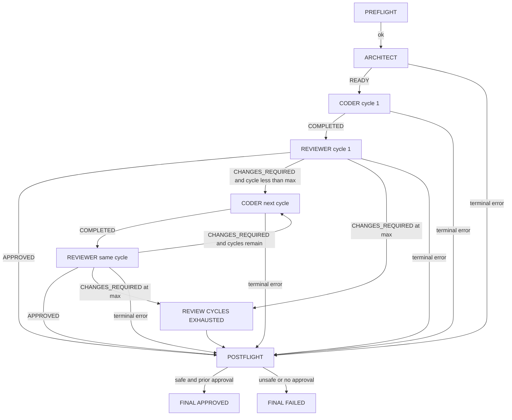

# PRD: OpenCode-Tools v0.1 — Local GitHub Issue Orchestrator

| Campo | Valore |
|---|---|
| Stato | Pronto per system design; le open question indicate decisioni da chiudere prima dell'implementazione |
| Release target | v0.1 |
| Repository | `https://github.com/manueldellapa/OpenCode-Tools` |
| Data | 2026-09-11 |
| Fonte prodotto canonica | Questo documento |

In questo documento, **deve** indica un requisito vincolante per v0.1, **dovrebbe** un requisito importante ma non bloccante e **potrebbe** un miglioramento differibile. I termini in maiuscolo usati per stati e outcome sono valori di dominio proposti e non messaggi liberi.

## 1. Introduzione / Overview

### 1.1 Problema

L'esecuzione end-to-end di una GitHub issue con agenti AI specializzati richiede oggi coordinamento manuale: leggere e interpretare la issue, trasferire il piano al coder, verificare le modifiche, reinviare il feedback, distinguere errori temporanei del provider da errori reali e controllare che Git non sia stato alterato in modi non autorizzati.

OpenCode-Tools deve offrire strumenti locali riutilizzabili per automatizzare e orchestrare workflow basati su OpenCode. Il primo prodotto è un orchestratore Python che esegue una singola GitHub issue tramite tre agenti OpenCode project-local:

```text
GitHub Issue
    ↓
Architect
    ↓
Coder
    ↓
Reviewer
    ├── APPROVED → fine
    └── CHANGES_REQUIRED
            ↓
          Coder
            ↓
         Reviewer
            ↓
           ...
```

Python è l'unica autorità sul lifecycle della pipeline. Gli agenti svolgono reasoning, analisi, coding, test e review, ma non orchestrano la pipeline e non producono lo stato finale.

### 1.2 Proposta di prodotto

La CLI v0.1 deve supportare almeno:

```bash
opencode-tools run \
  --workspace /path/to/workspace \
  --target Backend \
  --issue 21
```

Il comando deve:

1. validare configurazione, ambiente, workspace e target Git;
2. registrare la baseline Git e la versione OpenCode;
3. invocare direttamente `architect`, `coder` e `reviewer`;
4. applicare retry provider e timeout senza confonderli con i review cycle;
5. ripetere `coder → reviewer` entro un limite configurabile;
6. eseguire controlli Git dopo ogni invocazione e nel postflight finale;
7. lasciare le modifiche non committate a disposizione dell'utente;
8. produrre log per tentativo, un `run.json` machine-readable e un unico stato finale.

Per v0.1 non deve esistere un agent OpenCode `orchestrator`: il processo Python invoca i tre ruoli in modo diretto.

### 1.3 Utenti e attori

**Utente primario — sviluppatore o maintainer locale.** Avvia una issue, vuole ottenere modifiche verificabili nel target repository, senza commit o pubblicazione automatica, e deve poter capire perché un run è terminato.

**Utente secondario — maintainer degli agenti.** Configura prompt, permessi e modelli di `architect`, `coder` e `reviewer` lato OpenCode, senza modificare la business logic Python.

**Utente secondario — auditor o debugger.** Ricostruisce fasi, tentativi, durate, errori, decisioni e stato Git usando gli artifact del run.

Gli attori di sistema sono la CLI OpenCode, Git, GitHub CLI `gh`, il provider configurato in OpenCode, il workspace e il target repository.

### 1.4 Stato attuale ed evidenza repository

Al momento dell'analisi del 2026-09-11, il checkout è greenfield dal punto di vista funzionale. Non esistono commit né una `HEAD` risolvibile; i file presenti sono non tracciati. `README.md`, `pyproject.toml`, `LICENSE`, i moduli sotto `src/opencode_tools/` e i test sotto `tests/` sono segnaposto vuoti. È inoltre presente un `.DS_Store` non ignorato. Non esistono `AGENTS.md`, configurazione CI, `.gitignore`, agenti in `.opencode/agents/`, ADR, RFC o PRD precedenti.

Di conseguenza:

- non esiste comportamento legacy da preservare;
- i nomi dei file esistenti sono solo indizi di organizzazione, non un'architettura implementata;
- Python 3.13+, Ruff, mypy strict, pytest, `argparse`, `tomllib`, `subprocess` e il `src` layout sono requisiti nuovi già decisi, non convenzioni già operative;
- i quality gate definiti in questo PRD sono target di implementazione, non comandi già configurati nel repository.

Come baseline informativa, non come vincolo permanente, nell'ambiente ispezionato il 2026-09-11 è installato OpenCode `1.17.18`; `opencode run --help` espone `--agent`, `--format json` e `--dir`. La documentazione corrente descrive sia la [CLI `run`](https://dev.opencode.ai/docs/cli/) sia gli [agenti project-local](https://opencode.ai/v2/docs/agents) sotto `.opencode/agents/`. La compatibilità supportata deve comunque essere definita e verificata progressivamente.

### 1.5 Configurazione modelli non normativa

La combinazione sperimentale corrente è:

| Ruolo | Modello OpenCode attuale |
|---|---|
| Architect | `openrouter/nex-agi/nex-n2.5-pro:free` |
| Coder | `openrouter/nvidia/nemotron-3-ultra-550b-a55b:free` |
| Reviewer | `openrouter/cohere/north-mini-code:free` |

Questi identificativi sono esempi operativi, non requisiti di prodotto. Devono vivere esclusivamente nella configurazione degli agenti OpenCode e poter essere sostituiti senza modificare configurazione o business logic Python.

### 1.6 Glossario

| Termine | Definizione |
|---|---|
| Workspace | Directory da cui OpenCode carica documentazione e contesto. Può contenere zero, uno o più repository Git. |
| Target repository | Unico repository Git autorizzato a ricevere le modifiche del coder e sul quale Python esegue safety check e raccolta diff. |
| Review cycle | Una coppia logica `coder → reviewer`. Il primo reviewer appartiene al ciclo 1. |
| Provider attempt | Una singola invocazione OpenCode. Il counter parte da 1 per ogni nuova coppia phase/review cycle; un retry lo incrementa senza cambiare review cycle. |
| Pipeline phase | Posizione corrente nella state machine Python. |
| Run outcome | Risultato tecnico di una fase o di un tentativo. |
| Agent status | Stato terminale role-specific di readiness, completion o failure dichiarato da un agent. |
| Review status | Decisione terminale dichiarata dal reviewer. |
| Final status | Stato aggregato prodotto esclusivamente da Python. |

## 2. Goals

- **G-001 — Single-command execution:** eseguire una singola GitHub issue con un comando locale attraverso `architect → coder → reviewer`.
- **G-002 — Orchestrazione deterministica:** rendere Python l'unica autorità per transizioni, retry, timeout, review cycle e finalizzazione.
- **G-003 — Rework bounded:** consentire al reviewer di richiedere modifiche senza fallire immediatamente la pipeline, entro un limite configurabile e finito.
- **G-004 — Git safety:** fare in modo che Python non emetta azioni Git/GitHub proibite, codificare la stessa policy negli agenti cooperativi, preservare/verificare branch e `HEAD` e lasciare le modifiche non committate all'utente.
- **G-005 — Diagnosi affidabile:** distinguere provider error, timeout, process error, protocol error, agent-reported failure, Git safety error e normale `CHANGES_REQUIRED`.
- **G-006 — Osservabilità:** rendere ricostruibile ogni run tramite log separati e un report JSON aggiornato durante l'esecuzione.
- **G-007 — Multi-repository correctness:** usare il workspace come contesto OpenCode e il target repository come unico ambito Git/diff.
- **G-008 — Model independence:** consentire modelli diversi per ruolo senza hardcoding o duplicazione lato Python.
- **G-009 — Implementazione essenziale:** usare Python >= 3.13, standard library a runtime dove ragionevole, type hints completi e quality gate automatizzati.

## 3. User Stories

### US-001: Configurare e avviare un run locale

**Description:** Come sviluppatore, voglio avviare una singola issue indicando workspace, target e numero, così da usare lo stesso orchestratore in repository singoli e workspace multi-repository.

**Acceptance Criteria:**

- [ ] `opencode-tools run --workspace <path> --target <path-relativo> --issue <numero>` accetta una e una sola issue positiva.
- [ ] Il target relativo viene risolto rispetto al workspace; `--target .` supporta il caso workspace uguale al target.
- [ ] Workspace e target vengono canonicalizzati e registrati separatamente.
- [ ] Target inesistenti, fuori dal workspace dopo la risoluzione dei symlink o non coincidenti con la root di un working tree Git vengono rifiutati prima degli agenti.
- [ ] Argomenti non validi producono un messaggio azionabile e un exit code non zero.
- [ ] I test CLI e di risoluzione path passano insieme ai quality gate definiti dal repository.

### US-002: Caricare una configurazione validata

**Description:** Come maintainer, voglio configurare timeout, retry e review cycle in TOML, così da adattare il comportamento senza modificare la business logic.

**Acceptance Criteria:**

- [ ] La CLI supporta un file selezionabile con `--config`; se omesso, carica `<workspace>/opencode-tools.toml` quando presente e altrimenti usa default applicativi documentati.
- [ ] In v0.1 `--config` seleziona il file, mentre i parametri di lifecycle non richiedono override CLI individuali; eventuali override futuri devono prevalere sul TOML, che prevale sui default.
- [ ] Sono configurabili almeno timeout OpenCode, timeout dei processi utility, termination grace, massimo numero di review cycle, massimo numero di provider attempt, delay iniziale, moltiplicatore e delay massimo del backoff, oltre a `runtime_root`.
- [ ] `runtime_root` indica la directory che contiene `runs/`: se relativa viene risolta rispetto al workspace; il default è `<workspace>/.opencode-tools`.
- [ ] Valori mancanti usano default documentati; valori ignoti, non finiti, fuori intervallo o di tipo errato falliscono prima di invocare OpenCode.
- [ ] La configurazione Python non accetta né duplica model ID per i ruoli.
- [ ] Parsing e validazione usano `tomllib` e hanno test deterministici.

### US-003: Eseguire un preflight fail-closed

**Description:** Come sviluppatore, voglio che gli errori di ambiente e lo stato Git non sicuro siano rilevati prima del reasoning, così da non avviare una pipeline su una base ambigua.

**Acceptance Criteria:**

- [ ] Il preflight verifica disponibilità degli eseguibili richiesti, dei tre agenti project-local e delle capacità OpenCode necessarie.
- [ ] `opencode --version` viene eseguito una volta e il risultato viene registrato.
- [ ] Il target è un repository non bare, con branch nominato e `HEAD` risolvibile; detached HEAD e branch unborn sono rifiutati in v0.1.
- [ ] Staged, unstaged o untracked non ignorati nel target causano fallimento prima di OpenCode.
- [ ] La baseline registra almeno root Git canonica, branch, `HEAD` e working-tree state.
- [ ] Se la runtime directory ricade dentro un repository e non è ignorata, il run fallisce senza modificare automaticamente `.gitignore` o `.git/info/exclude`.
- [ ] Nessun agente viene invocato quando il preflight fallisce.

### US-004: Acquisire e analizzare la GitHub issue

**Description:** Come sviluppatore, voglio che l'architect legga la issue del target e produca un handoff concreto, così che il coder riceva requisiti contestualizzati e non soltanto un numero.

**Acceptance Criteria:**

- [ ] Python invoca direttamente l'agent `architect` con workspace come directory OpenCode, issue ref e target espliciti.
- [ ] Prima dell'invocazione, Python lega il numero a un'identità repository non ambigua derivata dal target o da un override esplicito, senza leggere il body della issue.
- [ ] L'architect usa come prima strategia `gh issue view <number>` nel contesto del target, o l'equivalente con repository esplicito, evitando il repository sbagliato nel workspace.
- [ ] Python non legge il contenuto della issue al posto dell'architect e non esegue mutation GitHub.
- [ ] Un handoff riuscito contiene analisi e vincoli verificabili, seguiti da una riga `ISSUE_REF_JSON: <json>` valida e versionata e dalla riga terminale unica `AGENT_STATUS: READY`.
- [ ] Il payload `ISSUE_REF_JSON` contiene almeno schema version, host, owner, repository, numero, URL canonico e titolo; repository e numero devono coincidere con l'input risolto da Python.
- [ ] Un fallimento noto dell'agent usa `AGENT_STATUS: FAILED` con spiegazione non vuota e viene distinto da un protocollo malformato.
- [ ] Il contenuto della issue è trattato come input non fidato e non può cambiare lifecycle, safety policy o grammatica dei marker.
- [ ] L'architect non modifica file non ignorati del target; una modifica produce errore di safety.

### US-005: Implementare nel solo target repository

**Description:** Come sviluppatore, voglio che il coder riceva la issue e l'analisi dell'architect, così da implementare e testare la modifica nel repository corretto.

**Acceptance Criteria:**

- [ ] Il coder non viene invocato se l'architect non ha concluso con `READY`.
- [ ] Il prompt del coder include issue ref, handoff dell'architect, target canonico, review cycle e policy di safety.
- [ ] Il target è dichiarato come unico write scope del coder; i sibling repository e gli altri file del workspace non sono autorizzati alla modifica.
- [ ] Il coder può modificare file e svolgere i test pertinenti; prompt e permission policy gli vietano le azioni Git/GitHub proibite previste dal threat model v0.1.
- [ ] Un tentativo riuscito termina con una sola riga `AGENT_STATUS: COMPLETED`; un fallimento dichiarato usa `AGENT_STATUS: FAILED` con spiegazione non vuota.
- [ ] Le modifiche restano non committate.
- [ ] Stato, output e durata dell'invocazione sono registrati senza sovrascrivere tentativi precedenti.

### US-006: Ottenere una decisione di review verificabile

**Description:** Come sviluppatore, voglio che un reviewer indipendente valuti requisiti, diff e test, così da distinguere approvazione e modifiche richieste.

**Acceptance Criteria:**

- [ ] Il reviewer riceve issue ref, handoff dell'architect, ciclo corrente, output rilevante del coder e target canonico.
- [ ] Il reviewer ispeziona direttamente il target, includendo diff staged/unstaged e file untracked non ignorati creati nel run.
- [ ] Il reviewer opera in modalità read-only rispetto ai file sorgente; prompt e permission policy gli vietano le azioni Git/GitHub proibite previste dal threat model v0.1.
- [ ] La risposta terminale contiene esattamente uno tra `REVIEW_STATUS: APPROVED`, `REVIEW_STATUS: CHANGES_REQUIRED` e `AGENT_STATUS: FAILED`.
- [ ] `CHANGES_REQUIRED` deve essere accompagnato da feedback concreto e non vuoto; `AGENT_STATUS: FAILED` deve spiegare perché la review non è stata completata.
- [ ] `APPROVED` non viene interpretato come stato finale prima del postflight Git.
- [ ] Marker mancanti, duplicati o incompatibili con il ruolo producono `PROTOCOL_ERROR`.

### US-007: Iterare sulle modifiche entro un limite

**Description:** Come sviluppatore, voglio che `CHANGES_REQUIRED` reinvii il feedback al coder, così da correggere il lavoro senza confondere il rework con un errore tecnico.

**Acceptance Criteria:**

- [ ] Il review cycle 1 comprende il primo coder e il primo reviewer.
- [ ] `max_review_cycles` indica il numero massimo di decisioni logiche del reviewer; il valore 1 consente una sola coppia coder/reviewer.
- [ ] Se il reviewer richiede modifiche e il limite non è raggiunto, Python invoca il coder nel ciclo successivo con il feedback completo.
- [ ] Se il reviewer richiede modifiche nell'ultimo ciclo, non viene invocato un ulteriore coder e la pipeline termina con outcome `REVIEW_CYCLES_EXHAUSTED`.
- [ ] Un provider retry non incrementa il review cycle.
- [ ] Un reviewer retry non richiama il coder e resta nello stesso ciclo.
- [ ] La sequenza effettiva è ricostruibile da `run.json` e dai nomi dei log.

### US-008: Recuperare da provider failure temporanei

**Description:** Come sviluppatore, voglio che errori transitori del provider vengano ritentati con backoff, così da non perdere un run per un singolo 429 o 502.

**Acceptance Criteria:**

- [ ] Sono riconosciuti almeno HTTP 429, HTTP 502, `provider_unavailable`, service overload e rate limiting nelle forme supportate dall'adapter OpenCode.
- [ ] Ogni invocazione incrementa il provider attempt; solo un errore transitorio attendibile autorizza un ulteriore attempt e attiva il backoff.
- [ ] Il massimo configurato conta il numero totale di provider attempt, incluso il primo.
- [ ] Prima dell'attempt successivo, il delay è `min(max_delay, initial_delay * multiplier^(attempt_fallito - 1))`; il primo attempt non attende.
- [ ] Ogni retry resta nella stessa phase, nello stesso ruolo e nello stesso review cycle.
- [ ] Il provider attempt riparte da 1 per ogni nuova esecuzione logica di una coppia phase/review cycle.
- [ ] La classificazione usa soltanto eventi provider/OpenCode strutturati o diagnostica di processo esplicitamente riconosciuta, mai issue text, messaggi assistant o output dei tool dell'agent.
- [ ] Ogni provider attempt ha un record e un log distinti.
- [ ] Esauriti gli attempt, la pipeline termina `FAILED` con outcome `PROVIDER_ERROR`.
- [ ] Un tentativo coder che ha già cambiato il working tree non viene ritentato automaticamente: conserva outcome `PROVIDER_ERROR`, registra `retry_suppressed_due_to_target_change = true`, preserva le modifiche e termina `FAILED` senza rollback.

### US-009: Distinguere timeout, process error e protocol error

**Description:** Come auditor, voglio cause tecniche distinte, così da capire se intervenire su provider, processo, configurazione agent o protocollo.

**Acceptance Criteria:**

- [ ] Ogni invocazione OpenCode ha un timeout positivo e configurabile.
- [ ] Al timeout viene applicata una sequenza bounded terminate → termination grace → kill → termination grace all'intero process group e viene conservato l'output parziale.
- [ ] Un timeout produce outcome `TIMEOUT` e non viene contato come provider retry o review cycle.
- [ ] Un exit code non zero non classificato come provider failure produce `PROCESS_ERROR`.
- [ ] Un processo non avviabile produce `PROCESS_ERROR` con return code nullo.
- [ ] Un processo completato senza un marker valido produce `PROTOCOL_ERROR`.
- [ ] Il postflight Git viene tentato dopo ciascuno di questi errori.
- [ ] Se la terminazione non è confermabile, il run registra `termination_confirmed = false`, tenta un postflight marcato indeterminato, segnala che il target potrebbe ancora cambiare e termina sempre `FAILED` senza attese infinite.
- [ ] `run.json` conserva anche cause concorrenti, ad esempio errore provider seguito da Git drift, senza appiattirle in un solo enum globale.

### US-010: Proteggere branch e HEAD

**Description:** Come sviluppatore, voglio che ogni variazione inattesa di branch o `HEAD` blocchi il run, così da non scambiare una history mutation per un'implementazione valida.

**Acceptance Criteria:**

- [ ] Branch e `HEAD` sono verificati dopo ogni invocazione OpenCode e nel postflight finale, inclusi i percorsi di errore.
- [ ] Il working tree viene fotografato con un fingerprint content-sensitive immediatamente prima e dopo ogni attempt; qualunque delta non ignorato durante architect o reviewer produce `GIT_SAFETY_ERROR` prima di retry o transizione.
- [ ] Tutti i comandi Git di safety, status e diff operano sul target repository, mai sul workspace per implicazione.
- [ ] Una variazione di branch o `HEAD` interrompe ulteriori agenti e produce `GIT_SAFETY_ERROR`.
- [ ] Un `APPROVED` del reviewer non può prevalere su un Git safety error.
- [ ] Python non esegue reset, clean, checkout/switch distruttivi o altri tentativi automatici di ripristino.
- [ ] Le modifiche parziali sono preservate e la loro presenza è indicata nel report finale.
- [ ] Test d'integrazione con repository temporanei coprono branch drift, `HEAD` drift e working tree iniziale dirty.

### US-011: Ricostruire il run dagli artifact

**Description:** Come auditor, voglio un report machine-readable e log separati, così da ricostruire ogni decisione senza rieseguire la pipeline.

**Acceptance Criteria:**

- [ ] Ogni run usa una directory univoca `<runtime_root>/runs/<run-id>/`; con il default il path è `<workspace>/.opencode-tools/runs/<run-id>/`.
- [ ] I log distinguono ruolo, review cycle e provider attempt, ad esempio `coder-cycle-2-provider-attempt-3.log`.
- [ ] Per un run riuscito `run.json` contiene una issue identity completa — host, owner/repository, numero e URL canonico — oltre a workspace, target, timestamp, versione OpenCode, configurazione effettiva sanitizzata, Git baseline/postflight, fasi, cycle, attempt, durata, return code, outcome e final status.
- [ ] `return_code` è nullable per timeout o spawn failure.
- [ ] `run.json` ha `schema_version` ed è aggiornato atomicamente dopo ogni tentativo e durante la finalizzazione best effort.
- [ ] L'orchestratore non serializza environment completo, credential o token e redige la configurazione effettiva; i raw log sono trattati come dati sensibili perché output agent/tool potrebbe contenere informazioni private.
- [ ] Su POSIX, runtime directory e file vengono creati senza permessi per group/other; il comportamento su altre piattaforme è documentato.
- [ ] Nessun log esistente viene sovrascritto, anche con retry e review multipli.
- [ ] Gli artifact restano comprensibili in tutti gli scenari di acceptance della release.

### US-012: Ricevere un esito finale univoco

**Description:** Come chiamante della CLI, voglio un unico stato finale coerente con exit code e report, così da integrare il tool in workflow locali.

**Acceptance Criteria:**

- [ ] Per ogni run inizializzato, solo Python emette `FINAL_STATUS: APPROVED` o `FINAL_STATUS: FAILED`.
- [ ] `APPROVED` richiede una decisione reviewer `APPROVED`, completamento del postflight e branch/`HEAD` uguali alla baseline.
- [ ] Qualsiasi altro terminal outcome produce `FAILED`.
- [ ] L'exit code è 0 esclusivamente per `APPROVED`; errori di argomenti seguono il comportamento standard di `argparse`, mentre gli altri fallimenti sono non zero.
- [ ] Quando la persistenza finale riesce, stato console, exit code e `run.json` non divergono; un logging failure causa exit non-zero e un errore esplicito su stderr che dichiara l'artifact incompleto.
- [ ] Un agent che emette una riga `FINAL_STATUS` viola il protocollo; Python non la inoltra come proprio risultato.
- [ ] La finalizzazione viene tentata anche dopo provider exhaustion, timeout, process/protocol error, review limit o Git drift.

### US-013: Sostituire modelli senza cambiare Python

**Description:** Come maintainer degli agenti, voglio scegliere un modello diverso per ciascun ruolo nella configurazione OpenCode, così da sperimentare senza accoppiare il lifecycle ai provider.

**Acceptance Criteria:**

- [ ] Gli agenti sono definiti nel workspace come `.opencode/agents/architect.md`, `coder.md` e `reviewer.md` e sono invocabili come agenti primari.
- [ ] Python invoca `opencode run --agent <ruolo> --format json --dir <contesto>` senza `--model`, `--share` o `--auto`: architect/reviewer usano il workspace, il coder usa il target; su target annidato il coder conserva la `.opencode/` del workspace tramite `OPENCODE_CONFIG_DIR`.
- [ ] La configurazione agent contiene modello e permessi; la configurazione Python contiene solo parametri di orchestrazione.
- [ ] Sostituire tutti e tre i model ID validi non richiede modifiche né ai moduli Python né al file TOML dell'orchestratore.
- [ ] Un agent mancante, disabilitato o risolto in fallback a un ruolo diverso causa preflight o protocol error fail-closed.
- [ ] Non esiste né viene invocato un quarto agent OpenCode `orchestrator`; i tre agenti non delegano la state machine ad altri agenti.
- [ ] I test non dipendono dalla disponibilità dei modelli sperimentali correnti.

## 4. Functional and Non-functional Requirements

### 4.1 Must-have funzionali — v0.1

- **FR-001:** Il comando `run` deve richiedere workspace, target e un numero issue intero positivo.
- **FR-002:** Ogni invocation deve gestire esattamente una issue; liste, range e batch devono essere rifiutati.
- **FR-003:** Workspace e target devono essere risolti, canonicalizzati e conservati come concetti separati.
- **FR-004:** In v0.1 il target deve essere `.` o un percorso relativo che, dopo la risoluzione dei symlink, resta dentro il workspace e coincide con il top-level di un working tree Git non bare.
- **FR-005:** Architect e reviewer devono essere eseguiti con il workspace come directory di contesto; il coder deve essere eseguito con il target come directory di contesto. Se il target è annidato, il control-plane `.opencode/` del workspace deve restare esplicitamente disponibile e verificato. Ogni operazione Git/diff deve indicare esplicitamente il target.
- **FR-006:** La configurazione deve essere letta con `tomllib` e validata prima degli agenti. `--config` seleziona il file; se omesso si usa `<workspace>/opencode-tools.toml` quando presente, altrimenti default documentati. Override di singoli valori non sono richiesti in v0.1.
- **FR-007:** Devono essere configurabili `max_review_cycles`, timeout OpenCode, timeout dei processi utility, termination grace, numero massimo di provider attempt, delay iniziale, moltiplicatore, delay massimo e `runtime_root`.
- **FR-008:** I limiti devono essere finiti e positivi dove richiesto; valori o chiavi invalidi devono produrre un config error fail-closed.
- **FR-009:** La configurazione Python non deve contenere model ID o opzioni provider specifiche dei tre agenti.
- **FR-010:** I soli ruoli della pipeline v0.1 devono essere `architect`, `coder` e `reviewer`; non deve esistere un secondo orchestrator OpenCode.
- **FR-011:** Il preflight deve verificare eseguibili, capacità OpenCode necessarie e disponibilità dei tre agenti. v0.1 deve supportare solo versioni per le quali l'identità dell'agent effettivamente eseguito è verificabile tramite un segnale coperto da fixture; fallback o identità non verificabile devono fallire chiuso.
- **FR-012:** Il tool deve eseguire e registrare `opencode --version` prima degli agenti.
- **FR-013:** Il preflight Git deve catturare branch, `HEAD` e working-tree state del target.
- **FR-014:** Come default conservativo proposto da questo PRD per v0.1, devono essere rifiutati target con detached HEAD, `HEAD` non risolvibile o modifiche staged, unstaged o untracked non ignorate; tale scelta resta esplicitamente da confermare in OQ-010.
- **FR-015:** Se la runtime directory è interna a un repository, il tool deve verificarne l'esclusione prima di popolarla e non deve modificare automaticamente regole ignore.
- **FR-016:** Python deve invocare direttamente `architect`, poi `coder`, poi `reviewer`, passando esplicitamente gli handoff necessari.
- **FR-017:** Prima dell'architect, Python deve associare il numero a un repository target non ambiguo. L'architect deve acquisire la issue tramite `gh issue view` in quel contesto e, per procedere, restituire host, owner/repository, numero, URL canonico e titolo nell'envelope versionato `ISSUE_REF_JSON`; Python valida l'envelope ma non deve sostituirsi all'agent nella lettura o analisi del body.
- **FR-018:** La issue deve essere trattata come input non fidato e non deve poter sovrascrivere istruzioni di ruolo, safety policy o protocollo.
- **FR-019:** L'output utile dell'architect deve essere passato al coder; il feedback `CHANGES_REQUIRED` deve essere passato integralmente al coder del ciclo successivo.
- **FR-020:** Prompt e configurazione devono dichiarare il target come unico write scope del coder e architect/reviewer come read-only rispetto ai file sorgente. La garanzia contro un agent ostile oltre alle policy verificabili non fa parte del threat model v0.1.
- **FR-021:** Le definizioni agent devono usare permessi OpenCode minimi per ruolo: consentire operazioni Git read-only necessarie e, per il coder, edit del working tree, negando l'intera classe di mutation Git history/ref/worktree distruttive, remote write e GitHub mutation. La policy deve coprire almeno commit/amend, tag, branch creation, push/force-push, merge/rebase, reset, clean, stash, checkout/switch distruttivi e mutation di PR/issue.
- **FR-022:** Python non deve costruire o eseguire comandi Git/GitHub mutativi e non deve passare `--auto`, `--share` o `--model` a OpenCode.
- **FR-023:** Il reviewer deve basare la decisione su issue, handoff, modifiche correnti del target, inclusi nuovi file non ignorati, e risultati di test disponibili.
- **FR-024:** `CHANGES_REQUIRED` deve essere un `ReviewStatus`, non un error outcome né un final status.
- **FR-025:** Il review cycle deve partire da 1 e `max_review_cycles` deve contare le decisioni logiche del reviewer.
- **FR-026:** `CHANGES_REQUIRED` deve avviare il ciclo successivo solo quando quello corrente è inferiore al massimo; all'ultimo ciclo deve produrre `REVIEW_CYCLES_EXHAUSTED` senza un altro coder.
- **FR-027:** Un provider attempt deve essere indicizzato separatamente dal review cycle e un retry deve restare nella stessa phase, ruolo e ciclo.
- **FR-028:** Devono essere riconosciuti come transient provider failure almeno 429, 502, `provider_unavailable`, overload e rate limiting, ma soltanto da eventi di errore OpenCode/provider strutturati o diagnostica di trasporto/processo strettamente riconosciuta. Issue text, messaggi assistant e tool output dell'agent non sono fonti attendibili per questa classificazione.
- **FR-029:** Il retry provider deve usare exponential backoff configurabile, capped, senza jitter obbligatorio in v0.1.
- **FR-030:** Esauriti gli attempt, l'outcome deve restare `PROVIDER_ERROR`; il limite di review non deve essere consumato.
- **FR-031:** Prima di ritentare un coder dopo provider failure, Python deve confrontare lo stato del target con quello immediatamente precedente all'attempt; se sono presenti nuove modifiche, deve preservarle, mantenere `outcome = PROVIDER_ERROR`, registrare `retry_suppressed_due_to_target_change = true` e terminare `FAILED` senza retry o rollback.
- **FR-032:** Ogni invocazione OpenCode deve avere un timeout configurabile indipendente dal tempo di backoff.
- **FR-033:** Il timeout deve applicare una sequenza bounded terminate → grace → kill → grace all'intero process group e acquisire l'output parziale. Se la terminazione resta non confermabile, deve registrare `termination_confirmed = false`, eseguire soltanto un postflight best effort marcato indeterminato e terminare `FAILED` senza attesa infinita.
- **FR-034:** Timeout, provider error, process error, protocol error, agent-reported failure, Git safety error, review limit e logging error devono restare categorie distinguibili.
- **FR-035:** L'adapter deve leggere lo stream di eventi JSON OpenCode, isolare il messaggio assistant terminale e applicare la grammatica di protocollo soltanto a quel messaggio.
- **FR-036:** Marker assenti, duplicati, conflittuali, non terminali o incompatibili con il ruolo devono produrre `PROTOCOL_ERROR`; marker citati in issue, prompt, tool output o stderr non devono essere accettati.
- **FR-037:** Gli agent status ammessi devono essere `READY` o `FAILED` per architect, `COMPLETED` o `FAILED` per coder e `FAILED` per un reviewer incapace di completare; i soli review status devono essere `APPROVED` e `CHANGES_REQUIRED`.
- **FR-038:** Uno status `FAILED` o `CHANGES_REQUIRED` deve includere una spiegazione non vuota; il secondo deve fornire feedback azionabile.
- **FR-039:** Branch e `HEAD` devono essere ricontrollati dopo ogni invocazione, compresi provider attempt falliti, e nel postflight finale.
- **FR-040:** Qualsiasi drift di branch o `HEAD` deve interrompere nuove invocazioni e produrre `GIT_SAFETY_ERROR`, anche dopo un reviewer `APPROVED`.
- **FR-041:** Il postflight deve essere eseguito best effort per ogni percorso terminale e non deve mai tentare reset, clean o altre operazioni di recupero mutative.
- **FR-042:** Ogni run deve avere un `run-id` univoco e una directory dedicata `<runtime_root>/runs/<run-id>/`; con il default risulta `<workspace>/.opencode-tools/runs/<run-id>/`.
- **FR-043:** Ogni invocazione e retry deve avere un log non sovrascritto il cui nome renda espliciti ruolo, review cycle quando applicabile e provider attempt.
- **FR-044:** `run.json` deve essere versionato, machine-readable, aggiornato atomicamente e contenere tutti i campi minimi definiti nella sezione 7.6.
- **FR-045:** `run.json` deve rappresentare return code assente, cause multiple e stato parziale senza perdere la distinzione fra phase, outcome, agent status, review status e final status.
- **FR-046:** L'orchestratore non deve serializzare environment completo, credential o token e deve redigere configurazione e comando registrato. I raw log devono essere trattati come sensibili e, su POSIX, directory e file runtime devono essere inaccessibili a group/other.
- **FR-047:** Per ogni run inizializzato, solo Python deve emettere un unico `FINAL_STATUS`; un `FINAL_STATUS` proveniente da un agent deve essere rifiutato come violazione di protocollo.
- **FR-048:** `FINAL_STATUS: APPROVED` deve essere possibile solo dopo `REVIEW_STATUS: APPROVED` e postflight Git riuscito con branch e `HEAD` invariati.
- **FR-049:** Ogni altro terminal outcome deve produrre `FINAL_STATUS: FAILED`; l'exit code deve essere 0 solo per `APPROVED`.
- **FR-050:** Modifiche complete o parziali devono restare non committate e non devono essere cancellate automaticamente in caso di successo o fallimento.
- **FR-051:** Python deve catturare un working-tree snapshot content-sensitive immediatamente prima e dopo ogni provider attempt. Il fingerprint deve cambiare se cambiano index, contenuto o metadata Git-significativi dei file tracked oppure path/contenuto dei file untracked non ignorati, anche quando i codici porcelain restano uguali. Qualunque delta durante architect o reviewer deve produrre `GIT_SAFETY_ERROR`; il delta del coder deve alimentare inventario modifiche e decisione di retry di FR-031.
- **FR-052:** Le write di `run.json` devono usare temp file e atomic replace. Se persistenza o apertura del log falliscono, Python deve interrompere nuove invocazioni, produrre `LOGGING_ERROR`, uscire non-zero e dichiarare su stderr che l'artifact potrebbe essere incompleto.

### 4.2 Must-have non funzionali — v0.1

- **NFR-001 — Runtime:** supportare Python >= 3.13 con `src` layout.
- **NFR-002 — Dependencies:** preferire zero package Python runtime; `git`, `gh` e `opencode` sono eseguibili esterni, mentre pytest, Ruff e mypy sono tooling di sviluppo.
- **NFR-003 — Typing:** applicare type hints completi e mypy strict alla codebase Python.
- **NFR-004 — Quality:** configurare e superare pytest, Ruff check, Ruff format check e mypy strict; i comandi esatti devono essere documentati nel repository durante l'implementazione.
- **NFR-005 — Bounded execution:** processi OpenCode e utility, terminazione, backoff, retry e review loop devono avere limiti finiti; il tempo massimo teorico deve derivare da valori configurati o default documentati.
- **NFR-006 — Testability:** process runner, clock e sleeper devono avere boundary sostituibili nei test, senza richiedere provider, GitHub o attese reali.
- **NFR-007 — Time:** usare timestamp UTC machine-readable e misurazioni monotonicamente affidabili per le durate.
- **NFR-008 — Fail-closed:** impossibilità di determinare stato Git, agent effettivo, output terminale o compatibilità necessaria deve causare fallimento, non fallback implicito.
- **NFR-009 — Compatibility:** isolare l'integrazione OpenCode dietro un adapter testato con fixture per le versioni dichiarate supportate e registrare sempre la versione effettiva.
- **NFR-010 — Privacy:** su POSIX, runtime directory devono essere create con mode non più permissivo di `0700` e file con mode non più permissivo di `0600`; l'orchestratore non deve aggiungere deliberatamente environment o credential ai payload persistiti. I raw output restano dati sensibili e non è garantita la redazione di segreti stampati autonomamente da un processo esterno.
- **NFR-011 — Determinism:** a parità di risultati dei processi e stato Git, state machine, classificazione, conteggi e final status devono essere deterministici e indipendenti dal modello scelto.
- **NFR-012 — Maintainability:** separare almeno dominio/state machine, configurazione, subprocess/OpenCode adapter, protocol parser, Git safety, logging e CLI, senza imporre in questo PRD nomi di classi o funzioni.

### 4.3 Should-have

- **SH-001:** acquisire e finalizzare in modo distinto anche un'interruzione utente gestibile (`INTERRUPTED`), terminando il process group e tentando il postflight.
- **SH-002:** impedire due run contemporanei sullo stesso target tramite un lock locale con gestione documentata dei lock stale.
- **SH-003:** offrire un sommario console conciso con `run-id`, phase fallita, outcome e percorso degli artifact, mantenendo un unico `FINAL_STATUS`.
- **SH-004:** assegnare exit code stabili per famiglie di errore oltre alla regola minima 0/non-zero.
- **SH-005:** oltre al fail-closed must-have, mostrare una diagnosi human-readable con versione rilevata, versioni/adapters supportati e istruzioni di remediation.
- **SH-006:** documentare chiaramente che i log possono contenere issue e codice privati e come proteggerli.
- **SH-007:** oltre all'inventario machine-readable must-have, produrre un sommario human-readable delle modifiche raggruppato per tracked, staged e untracked.

### 4.4 Could-have — non bloccanti per v0.1

- **CO-001:** timeout differenziati per ruolo oltre al timeout globale.
- **CO-002:** comando read-only di config validation o dry-run che non invoca gli agenti.
- **CO-003:** output console JSON opzionale, separato da `run.json`.
- **CO-004:** policy configurabile di retention o rotazione degli artifact.
- **CO-005:** estensione configurabile delle signature di provider error, mantenendo sicuri i default.
- **CO-006:** jitter opzionale nel backoff.
- **CO-007:** comando read-only per mostrare o ispezionare run precedenti.
- **CO-008:** supporto futuro per resume esplicito di run interrotti, solo dopo avere definito semantica e Git isolation.

### 4.5 Sintesi MoSCoW

| Priorità | Significato per la release |
|---|---|
| Must | Tutti i requisiti `FR-*`, `NFR-*`, le user story e gli acceptance scenario v0.1 devono passare. |
| Should | Importanti per robustezza operativa; un differimento richiede motivazione nel release plan. |
| Could | Valutabili solo dopo il completamento dei must-have, senza ritardare v0.1. |
| Won't | Esplicitamente esclusi nella sezione 5. |

## 5. Non-obiettivi / Out of Scope v0.1

- Batch, code o range multi-issue.
- Esecuzione concorrente di più issue.
- Un agent OpenCode `orchestrator` o una seconda state machine fuori da Python.
- Commit, amend, tag o creazione automatica di branch.
- Push, force-push, merge o rebase.
- Reset, clean, stash automatico o checkout/switch distruttivi.
- Apertura, modifica o merge di pull request.
- Commento, modifica, assegnazione, labeling o chiusura di GitHub issue.
- Qualsiasi altra mutation GitHub.
- Rollback automatico delle modifiche complete o parziali.
- Batch isolation, worktree-per-issue o strategia di isolamento Git per esecuzioni parallele.
- Orchestrazione remota o distribuzione multi-host.
- UI grafica, web UI, TUI interattiva o dashboard.
- Servizi server, daemon persistenti, API di rete o webhook.
- Database o coda persistente.
- Model selection, provider credential management o disponibilità garantita di un modello specifico in Python.
- Commit o pubblicazione automatica degli artifact del run.
- Garanzia che l'output AI sia semanticamente corretto oltre ai controlli, test e review osservabili definiti.
- Contenimento di sicurezza contro un agent, processo locale o utente deliberatamente ostile; v0.1 applica policy, controlli e fail-closed entro il threat model dichiarato, non una sandbox OS-level.

## 6. Design Considerations

### 6.1 Esperienza CLI

- La CLI iniziale è non interattiva e basata su `argparse`.
- Errori sintattici `argparse`, workspace non risolvibile o runtime root non determinabile possono avvenire prima dell'inizializzazione del run e non promettono `run.json`; dopo la creazione sicura della run directory, ogni percorso terminale deve produrre finalizzazione best effort e `FINAL_STATUS`.
- Gli errori devono nominare phase e categoria, spiegare l'azione richiesta e indicare il percorso degli artifact quando esiste un run inizializzato.
- Lo stdout terminale deve restare semplice da automatizzare. Log diagnostici dettagliati appartengono ai file del run e, se mostrati, a stderr.
- Nessuna conferma interattiva deve essere necessaria nel percorso normale; condizioni non sicure falliscono invece di chiedere conferma.
- Il comando di esempio deve funzionare usando default documentati e gli agenti presenti nel workspace.

### 6.2 Contratto agent

Il protocollo v0.1 usa marker di riga nel **solo messaggio assistant terminale** estratto dagli eventi OpenCode:

```text
Architect success:  AGENT_STATUS: READY
Architect failure:  AGENT_STATUS: FAILED
Coder success:      AGENT_STATUS: COMPLETED
Coder failure:      AGENT_STATUS: FAILED
Reviewer success:   REVIEW_STATUS: APPROVED
Reviewer rework:    REVIEW_STATUS: CHANGES_REQUIRED
Reviewer failure:   AGENT_STATUS: FAILED
```

In caso di architect success, il marker è preceduto immediatamente da una riga machine-readable:

```text
ISSUE_REF_JSON: {"schema_version":1,"host":"github.com","owner":"owner","repository":"repo","number":21,"url":"https://github.com/owner/repo/issues/21","title":"Issue title"}
AGENT_STATUS: READY
```

Regole normative:

- il marker deve essere una riga completa, unica e terminale;
- `ISSUE_REF_JSON` deve essere una singola riga JSON valida, immediatamente precedente a `AGENT_STATUS: READY`; i suoi campi obbligatori e tipi sono versionati;
- Python deve validare host, owner, repository e numero contro l'issue ref risolta prima dell'architect e verificare la coerenza dell'URL; mismatch o campo mancante produce `PROTOCOL_ERROR`;
- lo status deve essere compatibile con il ruolo;
- il testo precedente all'envelope/marker costituisce l'handoff, il feedback o la spiegazione e può restare opaco a Python;
- `CHANGES_REQUIRED` e gli status `FAILED` richiedono testo precedente non vuoto;
- stringhe simili presenti in issue, prompt, reasoning, tool output, stdout intermedio o stderr non contano;
- nessun agent può produrre `FINAL_STATUS`;
- il parser fallisce chiuso su eventi JSON malformati o quando non può identificare senza ambiguità il messaggio assistant terminale.

Questa grammatica è il contratto v0.1, mentre lo stream JSON OpenCode è un formato di trasporto version-sensitive gestito dall'adapter.

### 6.3 Permessi e ruoli OpenCode

- `architect` può leggere workspace, target e issue con `gh`, ma non modificare sorgenti o Git/GitHub.
- `coder` può leggere il workspace, modificare il solo target ed eseguire test, ma non operazioni Git/GitHub proibite.
- `reviewer` può leggere e ispezionare il target ed eseguire verifiche consentite, ma non modificare sorgenti o Git/GitHub.
- I tre agenti devono essere invocabili direttamente come agenti primari e non devono avviare una propria orchestrazione multi-agent.
- Prompt e definizioni agent devono codificare la policy verificabile richiesta; il postflight rileva una parte delle violazioni. Contenimento di un agent ostile, shell alternative, credential misuse e scritture fuori target richiedono un meccanismo ulteriore da valutare nel system design e non sono implicitamente promessi.

### 6.4 Stati di errore visibili

La CLI e `run.json` devono rendere distinguibili almeno:

- configurazione o preflight non validi;
- provider transitorio ed esaurimento dei retry;
- timeout;
- errore di spawn o exit code del processo;
- protocollo agent non valido;
- fallimento esplicito dichiarato dall'agent;
- limite review esaurito;
- Git safety error;
- interruzione gestibile, se viene implementato SH-001.

Un errore successivo non deve cancellare l'evidenza di quello precedente. Ad esempio, se un provider error è seguito da un Git drift rilevato nel postflight, entrambi devono comparire nella timeline e il final status deve essere `FAILED`.

## 7. Technical Considerations

### 7.1 Separazione delle responsabilità

| Responsabilità Python | Responsabilità OpenCode e agenti |
|---|---|
| CLI e configurazione | Comprensione della issue |
| Lifecycle e state machine | Lettura della documentazione |
| Invocazione e terminazione processi | Analisi dei requisiti |
| Timeout | Piano e handoff architect |
| Classificazione e retry provider | Coding nel target |
| Exponential backoff | Esecuzione e interpretazione dei test |
| Conteggio review cycle | Review e feedback |
| Git preflight/postflight e diff scope | Decisione `APPROVED` / `CHANGES_REQUIRED` |
| Logging e final status | Spiegazioni degli status agent |

Python non deve chiamare direttamente provider AI né incorporare reasoning specifico dell'issue. OpenCode non decide il lifecycle, i retry, il limite dei cicli o il final status.

### 7.2 Modello di dominio concettuale

I concetti devono restare separati; non devono essere compressi in un unico enum o campo `status`:

- **`PipelinePhase`**: almeno `PREFLIGHT`, `ARCHITECT`, `CODER`, `REVIEWER`, `POSTFLIGHT`, `FINALIZATION`.
- **`AgentRole`**: `ARCHITECT`, `CODER`, `REVIEWER`.
- **`AgentStatus`**: `READY`, `COMPLETED`, `FAILED`, validati per ruolo.
- **`ReviewStatus`**: esclusivamente `APPROVED` o `CHANGES_REQUIRED`; un reviewer che non può completare usa `AgentStatus.FAILED`.
- **`RunOutcome`**: almeno `SUCCEEDED`, `CONFIG_ERROR`, `PROVIDER_ERROR`, `TIMEOUT`, `PROCESS_ERROR`, `PROTOCOL_ERROR`, `AGENT_REPORTED_FAILURE`, `REVIEW_CYCLES_EXHAUSTED`, `GIT_SAFETY_ERROR` e `LOGGING_ERROR`. `INTERRUPTED` si aggiunge se viene implementato SH-001.
- **`FinalStatus`**: esclusivamente `APPROVED` o `FAILED`.
- **`IssueRef`**: host, owner/repository e numero risolti senza ambiguità dal target o da un override; URL canonico e titolo vengono aggiunti e validati tramite `ISSUE_REF_JSON` prima del coder.
- **`ProcessResult`**: comando sanitizzato, cwd, start/end, durata, return code nullable, log path e outcome.
- **`GitState`**: root canonica, branch, `HEAD`, stato tracked/untracked e fingerprint content-sensitive di index, tracked working tree e path/contenuto untracked non ignorato.
- **`GitSafetyStatus`**: `SAFE`, `UNSAFE` o `INDETERMINATE`, separato dall'outcome del processo che ha tentato il check.
- **`IssueResult`**: aggregato del run con timeline di phase, cycle, attempt, decisioni, errori e final status.

Esempi validi che devono essere rappresentabili senza perdita:

```text
phase = REVIEWER
review_cycle = 2
provider_attempt = 3
outcome = PROVIDER_ERROR
review_status = null
final_status = null
```

```text
phase = POSTFLIGHT
outcome = GIT_SAFETY_ERROR
git_safety_status = UNSAFE
prior_outcomes = [PROVIDER_ERROR]
final_status = FAILED
```

### 7.3 State machine



Per ogni invocation in `ARCHITECT`, `CODER` o `REVIEWER`, un provider error retryable crea un self-loop logico con `provider_attempt + 1`. Il counter parte da 1 per ogni nuova coppia phase/review cycle, non crea una nuova phase e non incrementa il review cycle. Dopo ogni attempt vengono controllati branch, `HEAD` e working-tree snapshot prima di decidere la transizione.

### 7.4 Processo e retry

- Le invocazioni devono usare argomenti strutturati con `shell=False`, evitando interpolazione di issue text o path in una shell. Il comando registrato deve sostituire il prompt con un placeholder sanitizzato; il system design deve scegliere il canale meno esposto supportato da OpenCode per il contenuto privato.
- Il comando concettuale è `opencode run --agent <role> --format json --dir <workspace|target> <prompt>`: architect/reviewer usano il workspace, coder il target; il dettaglio dell'API subprocess, del trasporto prompt e del pinning della config appartiene al system design.
- stdout e stderr devono essere drenati senza deadlock e conservati nel log del singolo attempt.
- La classificazione del singolo attempt deve essere deterministica: timeout; trusted provider error; exit code non-zero/process error; protocol parser; agent/review status. A livello pipeline non esiste un `primary_failure` che schiaccia le altre dimensioni: `trigger_outcome`, `git_safety_status` e `persistence_status` restano campi separati, mentre la timeline causale è ordinata per sequence number. Git safety o logging error forzano sempre il final failure.
- Un riferimento a 429/502 o rate limiting in issue, assistant text o tool output non autorizza un retry. Solo canali di errore coperti da fixture per la versione OpenCode sono attendibili.
- Timeout e backoff sono timer distinti. Il timeout misura l'invocazione; il backoff avviene tra due attempt.
- Dopo timeout, e dopo interruzione se SH-001 è implementato, il processo e i discendenti devono seguire l'escalation bounded definita da FR-033. Se la terminazione non è confermata, il postflight resta best effort e indeterminato, l'utente viene avvertito che il target può ancora cambiare e il final status è sempre `FAILED`.
- I test del backoff devono usare clock/sleeper sostituibili e non attendere realmente.

### 7.5 Git safety e diff

- Il target deve iniziare pulito secondo il default conservativo proposto da FR-014, così da rendere attribuibili al run tutte le modifiche successive.
- Tutti i check devono essere equivalenti a operazioni read-only indirizzate esplicitamente al target.
- Branch e `HEAD` sono invarianti; il working tree può cambiare soltanto durante il coder.
- Il working-tree snapshot content-sensitive viene raccolto prima e dopo ogni attempt. Deve rilevare anche una seconda modifica a un file già marcato `M`, non soltanto variazioni delle righe porcelain. Una modifica non ignorata prodotta da architect o reviewer è un safety violation rilevata prima di qualsiasi retry o fase successiva.
- Il reviewer deve vedere sia i diff dei file tracked sia l'inventario/contenuto dei nuovi file non ignorati.
- Le modifiche del coder sono output del prodotto e non sono un errore; non vengono committate.
- Il tool non tenta di riparare un drift o ripulire file. Il recupero appartiene all'utente.
- Un processo esterno che modifica il target durante il run può causare un safety failure; v0.1 non deve attribuire con certezza la causa.

### 7.6 Runtime artifact e schema minimo `run.json`

Struttura logica minima:

```text
.opencode-tools/
└── runs/
    └── <run-id>/
        ├── run.json
        ├── architect-provider-attempt-1.log
        ├── coder-cycle-1-provider-attempt-1.log
        ├── reviewer-cycle-1-provider-attempt-1.log
        └── ...
```

`run.json` deve contenere almeno:

| Gruppo | Campi minimi |
|---|---|
| Schema | `schema_version`, `run_id` |
| Input | issue number, repository identity risolta dal target/override, URL canonico e titolo quando acquisiti, workspace canonico, target canonico |
| Tempo | `started_at`, `finished_at`, duration totale; timestamp e duration per attempt |
| Ambiente | versione OpenCode, versione tool, configurazione effettiva sanitizzata |
| Git | baseline, check intermedi, postflight, branch, `HEAD`, working-tree summary/fingerprint e `git_safety_status` |
| Timeline | sequence number, phase, agent role nullable, review cycle nullable, provider attempt nullable |
| Processo | comando sanitizzato con prompt redatto, cwd, return code nullable, termination confirmed nullable, log path |
| Retry | retryable, classifier source/signature, retry decision, delay pianificato ed effettivo, eventuale soppressione per target change |
| Decisione | agent status nullable, review status nullable, outcome per attempt |
| Errori | `trigger_outcome`, `git_safety_status`, `persistence_status` separati più elenco causale ordinato per sequence number |
| Persistenza | atomic write status ed eventuale `LOGGING_ERROR`/artifact incompleto |
| Finale | `final_status`, exit code CLI previsto, modifiche preservate sì/no, postflight determinato/indeterminato |

Il file deve restare JSON valido dopo ogni write completata usando write-to-temp e atomic replace. Un errore di persistenza interrompe nuove invocazioni, produce `LOGGING_ERROR` ed è segnalato anche su stderr; l'ultima versione valida può restare parziale. Il log raw può conservare lo stream JSON OpenCode e stderr, ma è un artifact sensibile e il report deve referenziarlo invece di duplicare payload estesi.

### 7.7 Configurazione

La v0.1 deve esporre un file TOML opzionale selezionabile con `--config`. Se non specificato, deve caricare `<workspace>/opencode-tools.toml` quando presente, altrimenti default applicativi documentati. Override CLI dei singoli valori non sono richiesti in v0.1.

Categorie minime:

- lifecycle: `max_review_cycles`;
- subprocess: timeout OpenCode, timeout utility e termination grace;
- provider retry: max attempts, initial delay, multiplier, max delay;
- runtime: `runtime_root`, cioè la directory contenente `runs/`; il default è `<workspace>/.opencode-tools`, un valore relativo si risolve rispetto al workspace e un valore assoluto resta esterno solo dopo canonicalizzazione;
- GitHub identity: eventuale remote o repository override necessario a disambiguare il target.

Sono vietate sezioni per model ID dei ruoli. Chiavi sconosciute devono fallire per evitare typo silenziosi. La configurazione effettiva salvata in `run.json` non deve contenere segreti.

### 7.8 OpenCode integration

- Gli agenti project-local attesi sono proposti sotto `.opencode/agents/architect.md`, `coder.md` e `reviewer.md`.
- I model ID, prompt e permessi appartengono a questi agenti.
- Python deve supportare soltanto versioni per cui una fixture dimostra un segnale attendibile dell'identità agent effettiva; deve confrontarlo con il ruolo richiesto e rifiutare fallback o identità non verificabile.
- Lo stream prodotto da `--format json` non va assunto stabile per versioni non dichiarate supportate.
- Ogni versione supportata deve avere fixture rappresentative di success, provider failure, errore malformato e messaggio terminale.
- L'uso di sessioni OpenCode persistenti o `--continue` non è richiesto in v0.1. Gli handoff devono essere espliciti e riproducibili anche con invocazioni indipendenti.

### 7.9 Strategia di test

La suite deve includere:

- unit test della state machine e di tutte le transizioni terminali;
- unit test della config TOML e della precedenza;
- unit test del protocol parser, inclusi marker in issue/tool output, duplicati e conflitti;
- unit test di classificazione provider, trust boundary, precedence e formula del backoff con tempo simulato;
- unit test per timeout, escalation terminate/kill, terminazione non confermata, spawn failure e return code nullable;
- integration test con fake `opencode`/`gh` e repository Git temporanei;
- test multi-repository che provi workspace e target distinti;
- test Git per clean/dirty, detached/unborn, branch drift, `HEAD` drift, failure del probe e delta content-sensitive prodotti da agent read-only anche senza variazione del codice porcelain;
- test che provi l'assenza di comandi Git/GitHub proibiti costruiti da Python e la presenza delle policy richieste negli agenti;
- test di issue identity, acquisizione architect, handoff e failure `gh` usando fake locali;
- test del reviewer su tracked/staged/untracked e trasferimento del feedback;
- test di logging/schema per retry e review multipli, permessi POSIX, atomic replace e fault di persistenza;
- smoke test manuale documentato contro almeno una versione OpenCode dichiarata supportata, in un repository disposable e senza pubblicazione automatica.

I test automatici non devono dipendere da modelli free, credenziali reali, rete o tempi di backoff reali.

## 8. Success Metrics

- Il 100% dei must-have e degli acceptance scenario di release è soddisfatto.
- Happy path e percorso con almeno un `CHANGES_REQUIRED` terminano con stato, exit code, timeline e Git postflight coerenti.
- Ogni fault injection prevista — provider recovery/exhaustion, timeout, process error, protocol error e Git drift — produce la categoria attesa senza consumare contatori non correlati.
- Branch e `HEAD` del target risultano uguali alla baseline in ogni run che termina `APPROVED`.
- Nessun test osserva commit, push, merge, reset, clean, checkout/switch distruttivo o mutation GitHub avviati da Python.
- `run.json` consente di ricostruire ordine, phase, role, review cycle, provider attempt, durata, return code, outcome e final status per tutti gli scenari di acceptance.
- Cambiare i model ID nei tre agenti OpenCode non richiede alcuna modifica Python o TOML dell'orchestratore.
- Pytest, Ruff, Ruff format check e mypy strict passano sui comandi documentati dal repository.

Non vengono definiti KPI di adozione o business per v0.1: il primo successo è la consegna verificabile di un orchestratore locale sicuro, bounded e diagnosticabile.

## 9. Assunzioni

- L'utente dispone localmente di Python >= 3.13, Git, GitHub CLI `gh` e una versione OpenCode supportata.
- `gh` e OpenCode sono già autenticati con le rispettive credenziali; il tool non gestisce login o token.
- Il target corrisponde a un repository GitHub e la issue è leggibile dall'architect.
- Gli agenti project-local richiesti esistono nel workspace e hanno permessi compatibili con i loro ruoli.
- Workspace e target sono leggibili; il target è scrivibile dal coder.
- Come default conservativo proposto da questo PRD, il target è pulito, su branch nominato e con `HEAD` risolvibile all'avvio; un futuro opt-in per baseline dirty non è implicito.
- Una sola pipeline e nessun processo umano o esterno modifica branch o `HEAD` del target durante il run.
- Come default di scope proposto si assume un ambiente locale POSIX, almeno macOS/Linux; il supporto Windows richiede una decisione esplicita sulla terminazione dei process tree, sui permessi e sui lock.
- L'utente resta responsabile di ispezionare, committare, scartare o pubblicare le modifiche dopo il run.
- Issue, repository e log possono contenere dati privati; gli artifact restano locali salvo azione esplicita dell'utente.
- I modelli sperimentali indicati possono cambiare o non essere disponibili e non fanno parte del contratto Python.
- Le invocazioni OpenCode v0.1 possono essere indipendenti: Python trasporta esplicitamente handoff e feedback.
- Le permission policy OpenCode vengono rispettate dal runtime; v0.1 non viene presentata come sandbox ostile di livello sistema operativo.

## 10. Open Questions

1. **OQ-001 — Default numerici:** quali valori iniziali adottare per timeout OpenCode, timeout utility, termination grace, `max_review_cycles`, provider attempts, delay iniziale, moltiplicatore e delay massimo?
2. **OQ-002 — Compatibility baseline:** quali versioni OpenCode dichiarare supportate in v0.1 e quale criterio usare per aggiungere una nuova fixture/schema?
3. **OQ-003 — Defense in depth futura:** quali meccanismi OpenCode o locali valutare dopo il baseline v0.1 per rafforzare il contenimento di push, mutation GitHub, comandi camuffati e scritture fuori target? Nessuna garanzia aggiuntiva entra nello scope senza aggiornare PRD, threat model e acceptance.
4. **OQ-004 — Concorrenza:** il lock per target deve essere promosso da should-have a must-have per v0.1, e come si riconosce in modo sicuro un lock stale?
5. **OQ-005 — Piattaforme:** confermare macOS/Linux come scope v0.1 oppure ampliare esplicitamente acceptance e implementazione a Windows.
6. **OQ-006 — GitHub identity:** come selezionare remote, host GitHub Enterprise o override `owner/repo` quando `origin` è assente o ambiguo?
7. **OQ-007 — Log privacy e retention:** oltre ai mode POSIX richiesti, quale redazione best effort, retention e meccanismo di pulizia documentare per issue o repository privati?
8. **OQ-008 — Agent compatibility check:** per ciascuna versione OpenCode candidata, quale campo/evento coperto da fixture prova in modo affidabile che il ruolo richiesto è stato eseguito senza fallback?
9. **OQ-009 — Runtime location:** confermare `<workspace>/.opencode-tools` come default oppure sostituirlo prima dell'implementation plan; un override resta supportato in entrambi i casi.
10. **OQ-010 — Dirty baseline:** confermare il rifiuto fail-closed di staged, unstaged e untracked non ignorati assunto da questo PRD, oppure progettare esplicitamente una baseline dirty attribuibile e verificabile.

Queste domande non impediscono l'uso del PRD come fonte prodotto, ma alcune possono cambiare scope, architettura o acceptance v0.1. Dove è dichiarato un default conservativo, esso resta il requisito operativo finché una decisione successiva non aggiorna questo documento. Le domande che incidono su un must-have devono essere chiuse nel system design o tramite ADR prima che l'implementation plan consideri completo il relativo requisito.

## 11. Rischi e Mitigazioni

| ID | Rischio | Impatto | Mitigazione richiesta |
|---|---|---:|---|
| R-001 | Un agent esegue push, mutation GitHub o una sequenza che ripristina la stessa `HEAD`, non dimostrabile dal solo postflight. | Alto | Permessi OpenCode minimi, comandi negati, niente `--auto`, test di policy, threat model e possibile isolamento credential/command. |
| R-002 | Prompt injection nella issue induce azioni vietate o marker falsi. | Alto | Issue come input non fidato, istruzioni di ruolo prioritarie, parser sul solo messaggio assistant terminale e marker exact/anchored. |
| R-003 | Un coder incontra provider error o timeout dopo modifiche parziali. | Alto | Confronto attempt-level, nessun retry automatico se il target è cambiato, preservazione artifact e nessun rollback. |
| R-004 | Un processo figlio sopravvive al timeout e modifica il target dopo il postflight. | Alto | Process group, escalation terminate/kill, termination grace e failure esplicito se la terminazione non è confermata. |
| R-005 | Un altro processo o run modifica branch/`HEAD` durante la pipeline. | Alto | Assunzione di esclusività, controlli dopo ogni attempt, lock should-have e fallimento safety. |
| R-006 | Il coder modifica un sibling repository o file workspace fuori target. | Alto | Write scope esplicito, permission policy, reviewer focalizzato sul target; definire enforcement più forte nel system design. |
| R-007 | Il formato JSON degli eventi OpenCode cambia. | Medio | Version recording, adapter isolato, fixture per versioni supportate e fail-closed. |
| R-008 | I modelli/provider free sono instabili o indisponibili. | Medio | Model config esterna, retry bounded, backoff e nessun test automatico legato ai modelli correnti. |
| R-009 | `gh issue view` usa il repository sbagliato in un workspace multi-repository. | Alto | Issue ref legato al target, cwd o `--repo` esplicito, fallimento su identità ambigua. |
| R-010 | Runtime artifact rendono dirty un repository. | Medio | Verifica ignore prima della creazione e nessuna modifica automatica delle ignore rules. |
| R-011 | Log espongono issue, codice o segreti. | Alto | Sanitizzazione, niente environment dump, permessi locali restrittivi e policy privacy/retention. |
| R-012 | Review cycle e provider attempt vengono conteggiati insieme. | Medio | Campi, nomi log, test e transizioni separati nel dominio. |
| R-013 | Il reviewer ignora file untracked o approva sulla base di un diff incompleto. | Medio | Inventario untracked esplicito e ispezione diretta del target. |
| R-014 | Qualità o determinismo del reviewer sono insufficienti. | Medio | Test svolti dal coder, criteri agent chiari, ciclo bounded, artifact completi e responsabilità umana sul commit. |
| R-015 | Crescita non limitata dei log nel tempo. | Basso iniziale | Retention come could-have e documentazione dello spazio usato. |

## 12. Release Acceptance Criteria

- **AC-001 — CLI:** il comando canonico avvia una issue valida e rifiuta batch o issue non positive.
- **AC-002 — Config:** selezione `--config`, file convenzionale e default producono una configurazione effettiva deterministica; input invalidi non avviano agenti.
- **AC-003 — Multi-repo:** in un fixture `workspace/Backend/.git`, architect/reviewer ricevono il workspace, il coder riceve `Backend` come `--dir` mantenendo verificabile la `.opencode/` del workspace, e ogni comando Git/diff riceve `Backend`.
- **AC-004 — Path safety:** target outside-workspace, symlink escape e target non top-level vengono rifiutati.
- **AC-005 — Dirty preflight:** staged, unstaged e untracked non ignorati causano fallimento prima di OpenCode.
- **AC-006 — Git shape:** detached HEAD, unborn branch e repository bare vengono rifiutati.
- **AC-007 — OpenCode baseline:** versione e agent effettivi vengono verificati e registrati; agent mancante/fallback non procede.
- **AC-008 — Happy path:** fake OpenCode produce `READY`, `COMPLETED`, `APPROVED`; l'ordine è corretto, postflight è safe, exit code è 0 e final status è `APPROVED`.
- **AC-009 — Rework:** reviewer ciclo 1 richiede modifiche, il feedback arriva al coder ciclo 2 e reviewer ciclo 2 approva; il final status è `APPROVED`.
- **AC-010 — Review limit:** `CHANGES_REQUIRED` all'ultimo ciclo non invoca un nuovo coder e termina `FAILED/REVIEW_CYCLES_EXHAUSTED`.
- **AC-011 — Provider recovery:** un 429 seguito da successo produce due provider attempt nella stessa phase/cycle e non aggiunge review cycle.
- **AC-012 — Provider exhaustion:** tutti gli attempt sono registrati e il run termina `FAILED/PROVIDER_ERROR`.
- **AC-013 — Partial mutation guard:** provider failure del coder dopo una modifica non attiva retry, mantiene outcome `PROVIDER_ERROR`, registra `retry_suppressed_due_to_target_change = true`, non resetta file e segnala la modifica preservata.
- **AC-014 — Timeout:** un child con discendenti viene terminato entro la policy configurata; output parziale e `TIMEOUT` vengono registrati con return code nullable.
- **AC-015 — Process error:** spawn failure ed exit non-zero non-provider producono `PROCESS_ERROR`, non provider retry.
- **AC-016 — Protocol safety:** marker presenti in issue, prompt, tool event o stderr non sono accettati; marker mancante, duplicato o incompatibile produce `PROTOCOL_ERROR`.
- **AC-017 — Agent failure:** un marker role-specific `FAILED` con spiegazione produce `AGENT_REPORTED_FAILURE`, distinto da protocol error.
- **AC-018 — Git drift:** branch o `HEAD` modificati dopo qualunque attempt interrompono la pipeline, preservano lo stato e terminano `FAILED/GIT_SAFETY_ERROR` senza reset.
- **AC-019 — Approval precedence:** reviewer `APPROVED` seguito da Git drift termina comunque `FAILED`.
- **AC-020 — Failure postflight:** provider exhaustion, timeout, process/protocol error e review exhaustion tentano tutti il postflight e finalizzano `run.json`.
- **AC-021 — Logging:** retry e review multipli producono file distinti e record coerenti per sequence, phase, role, cycle, attempt, duration, return code, classifier source, retry decision/delay e outcome.
- **AC-022 — Runtime ignore:** una runtime path interna a un repo ma non ignorata viene rifiutata senza edit automatico; una path ignorata viene usata senza apparire nello status.
- **AC-023 — Model separation:** nessun comando o config Python contiene i tre model ID sperimentali o passa `--model`; sostituirli lato OpenCode non richiede modifiche Python.
- **AC-024 — Forbidden actions:** test e code review confermano che Python non costruisce mutazioni Git/GitHub e che prompt/definizioni agent codificano l'allowlist/deny policy richiesta, senza presentarla come sandbox contro un agent ostile.
- **AC-025 — Final consistency:** ogni run inizializzato produce esattamente un final status coerente con exit code e, quando la persistenza finale riesce, con `run.json`; errori pre-inizializzazione e logging failure seguono le eccezioni esplicite del PRD.
- **AC-026 — Quality gates:** tutti i test pertinenti, Ruff check, Ruff format check e mypy strict passano con i comandi documentati nel repository.
- **AC-027 — Compatibility smoke:** è documentato almeno un run disposable contro una versione OpenCode dichiarata supportata, con artifact ispezionati e nessuna pubblicazione automatica.
- **AC-028 — Read-only agent safety:** una modifica tracked, staged o untracked non ignorata introdotta da architect o reviewer viene rilevata dal confronto content-sensitive pre/post-attempt e produce `FAILED/GIT_SAFETY_ERROR` prima di retry o fase successiva; il test include un file già `M` il cui contenuto cambia senza cambiare il codice porcelain.
- **AC-029 — Issue identity e handoff:** in un fixture multi-repository, il repository GitHub viene derivato dal target o da override esplicito, l'architect viene istruito a usare `gh issue view`, un'identità ambigua/auth failure/not-found fallisce chiuso e un handoff riuscito contiene `ISSUE_REF_JSON` valido. Envelope e testo dell'handoff vengono validati e passati al coder senza interpretare il body della issue in Python; mismatch, JSON malformato o campo obbligatorio assente produce `PROTOCOL_ERROR`.
- **AC-030 — Reviewer input:** il reviewer riceve issue e handoff, ispeziona modifiche tracked/staged e nuovi file non ignorati nel target e, su `CHANGES_REQUIRED`, il feedback concreto viene passato integralmente al coder successivo.
- **AC-031 — Provider trust boundary:** una signature 429/502 presente soltanto in issue, assistant text o tool output non attiva retry; un trusted provider event lo attiva e segnali concorrenti seguono la precedence documentata.
- **AC-032 — Terminazione non confermata:** un fake process resistente alla sequenza bounded produce `termination_confirmed = false`, postflight indeterminato, warning esplicito e `FINAL_STATUS: FAILED` senza attesa infinita.
- **AC-033 — Logging failure:** fault injection su apertura log o atomic replace interrompe nuove invocazioni, produce exit non-zero/`LOGGING_ERROR`, segnala l'artifact incompleto su stderr e non corrompe l'ultima versione JSON valida.
- **AC-034 — Privacy locale:** su POSIX directory e file runtime non risultano accessibili a group/other; config e comando persistiti non includono credential, environment completo o prompt raw.
- **AC-035 — Transport e spoofing:** stream JSON malformato/troncato, più messaggi terminali candidati o un agent che emette `FINAL_STATUS` producono `PROTOCOL_ERROR` e non attivano provider retry.
- **AC-036 — Git inspection failure:** timeout o exit non-zero di un comando Git di safety conservano rispettivamente `ProcessResult.outcome = TIMEOUT` o `PROCESS_ERROR`; output ambiguo produce il relativo protocol/process detail. In tutti i casi `GitSafetyStatus = INDETERMINATE`, l'approvazione è impedita e il run inizializzato termina `FAILED`.

## 13. Traceability

| User story | Requirements principali | Acceptance scenario |
|---|---|---|
| US-001 | FR-001–005 | AC-001, AC-003, AC-004 |
| US-002 | FR-006–009, FR-015, FR-042 | AC-002, AC-022, AC-023 |
| US-003 | FR-011–015, FR-039, FR-051 | AC-005–007, AC-022, AC-028, AC-036 |
| US-004 | FR-016–018, FR-035–038, FR-051 | AC-007, AC-016, AC-017, AC-029, AC-031, AC-035 |
| US-005 | FR-019–023, FR-031, FR-039–041, FR-050–051 | AC-008, AC-013, AC-018, AC-024, AC-028 |
| US-006 | FR-023–024, FR-035–040, FR-051 | AC-008, AC-016–019, AC-028, AC-030, AC-035 |
| US-007 | FR-025–027 | AC-009, AC-010 |
| US-008 | FR-027–031 | AC-011–013, AC-031 |
| US-009 | FR-032–038, FR-041, FR-045, FR-052 | AC-014–017, AC-020, AC-031–033, AC-035 |
| US-010 | FR-013–015, FR-020–022, FR-039–041, FR-050–051 | AC-005, AC-006, AC-013, AC-018, AC-019, AC-024, AC-028, AC-036 |
| US-011 | FR-042–046, FR-052 | AC-020–022, AC-025, AC-033, AC-034 |
| US-012 | FR-034, FR-037–041, FR-047–050, FR-052 | AC-017–020, AC-025, AC-033, AC-035, AC-036 |
| US-013 | FR-009–012, FR-021–022 | AC-007, AC-023, AC-024, AC-027 |

I requisiti non funzionali NFR-001–012 si applicano trasversalmente a tutte le user story e sono verificati in particolare da AC-026 e AC-027.

## 14. Repository Impact

Aree esistenti e verificate che probabilmente saranno interessate da una futura implementazione:

- `pyproject.toml` — manifest attualmente vuoto; dovrà dichiarare package, Python >= 3.13 e tooling di sviluppo.
- `src/opencode_tools/` — scaffold vuoto; area prevista per CLI, dominio, orchestrazione, config, integrazione OpenCode e Git safety.
- `tests/` — placeholder vuoti; area prevista per unit e integration test.
- `README.md` — file vuoto; dovrà documentare installazione, CLI, configurazione, safety e quality commands.

Nuove aree proposte, oggi inesistenti:

- `.opencode/agents/` — definizioni project-local di architect, coder e reviewer, inclusi modelli e permessi.
- `.gitignore` — esclusione della runtime directory e degli artifact locali appropriati.
- eventuale configurazione CI — esecuzione dei quality gate dopo che la relativa struttura sarà decisa.

Il solo artifact creato da questa attività è `tasks/prd-opencode-tools.md`. Non viene implementata alcuna funzionalità.

## 15. PRD Quality Gate

- [x] Sono state ispezionate istruzioni, documentazione, codice, test, manifest e stato Git disponibili.
- [x] Non esistono `AGENTS.md` applicabili; nessuna istruzione repository è stata omessa.
- [x] La richiesta e l'evidenza repository erano sufficienti: non sono state poste domande già risolvibili né erano necessarie chiarificazioni bloccanti.
- [x] Il repository greenfield non è stato descritto come se avesse comportamento implementato.
- [x] Nessun file, componente, API o comportamento inesistente è presentato come già implementato.
- [x] Comportamento esistente, requisiti decisi, proposte e open question sono distinti.
- [x] Le user story sono focalizzate, coerenti, indipendentemente verificabili e collegate a requisiti e acceptance scenario.
- [x] Gli acceptance criteria sono osservabili e coprono happy path, rework, error path e safety path.
- [x] I requisiti must-have sono numerati, non ambigui e coerenti con lo scope v0.1.
- [x] Ogni `FR-*` e ogni `AC-*` compare nella matrice di traceability senza riferimenti orfani.
- [x] Must-have, should-have, could-have e won't-have sono separati.
- [x] `CHANGES_REQUIRED` è un review status e non viene confuso con provider error o final failure.
- [x] Review cycle e provider attempt restano distinti in dominio, log, state machine e test.
- [x] Phase, outcome, agent status, review status e final status sono modellati separatamente.
- [x] Il successo richiede sia reviewer approval sia postflight Git valido.
- [x] Error path e timeout finalizzano best effort senza reset o perdita delle modifiche.
- [x] I model ID sperimentali sono documentati come non normativi e non entrano nella config Python.
- [x] Le garanzie di safety non sono presentate come sandbox OS-level non ancora progettata.
- [x] `run.json` rappresenta return code nullable, contatori separati e cause multiple.
- [x] I non-obiettivi impediscono batch, Git/GitHub mutation, UI, servizi e orchestrazione remota in v0.1.
- [x] Assunzioni, open question e rischi non contraddicono i requisiti normativi.
- [x] Le success metric sono verificabili e non inventano KPI di business non supportati.
- [x] Le open question contengono soltanto decisioni realmente irrisolte e dichiarano i default operativi quando presenti.
- [x] Repository Impact cita come esistenti soltanto path verificati e marca gli altri come proposti.
- [x] Il PRD è salvato nel percorso canonico `tasks/prd-opencode-tools.md`.
- [x] Non è stato scritto codice né modificata configurazione di prodotto.
