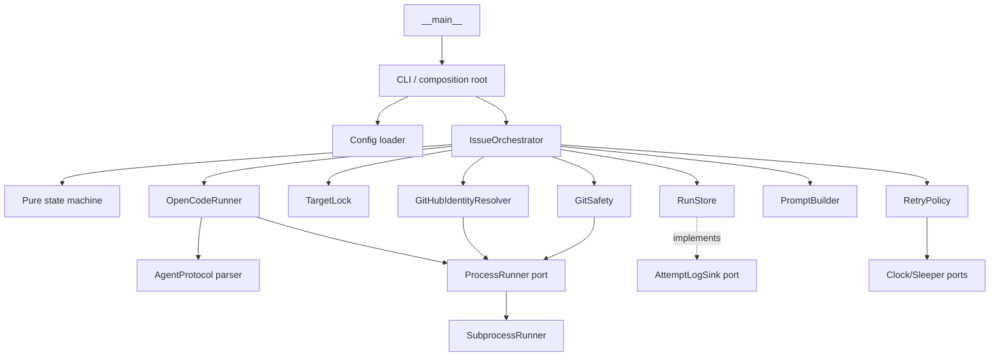
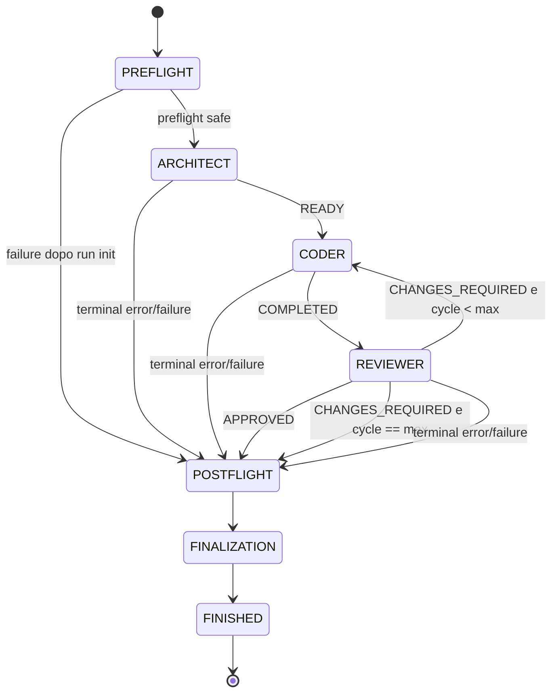

# System Design: OpenCode-Tools v0.1

| Campo | Valore |
|---|---|
| Stato | Proposto; pronto per derivare ADR e implementation plan |
| Release target | v0.1 |
| Data | 2026-09-11 |
| Fonte prodotto autorevole | [`tasks/prd-opencode-tools.md`](./prd-opencode-tools.md) |
| Scope dell'attività | Solo design tecnico; nessun codice applicativo |

Questo documento traduce il PRD canonico in una progettazione implementabile. Il PRD mantiene la precedenza normativa: il design non modifica scope, user story o acceptance criteria. Le fonti OpenCode citate sono soltanto evidenza tecnica non normativa per chiudere le decisioni di compatibilità.

## 1. Executive summary

OpenCode-Tools v0.1 sarà un CLI locale Python 3.13+ con sole dipendenze runtime di standard library. Python possiede lifecycle, state machine, processi, timeout, retry, Git safety, configurazione, protocol parsing, lock e persistenza. I tre agenti OpenCode project-local possiedono esclusivamente analisi, coding, test e review. Non esiste un agent `orchestrator`.

L'architettura usa un core deterministico e adapter sottili:

- `orchestrator.py` coordina componenti iniettati, ma non interpreta issue o qualità del codice;
- `state_machine.py` e `retry.py` sono funzioni pure;
- `process.py` implementa process execution generico e non conosce OpenCode;
- `opencode.py` interpreta il trasporto OpenCode version-specifico;
- `protocol.py` valida esclusivamente il messaggio assistant terminale;
- `git_safety.py` applica preflight, snapshot content-sensitive e postflight sul solo target;
- `runlog.py` mantiene `run.json` come source of truth atomica e log diagnostici per attempt;
- `locking.py` impedisce due run simultanei sullo stesso target.

Le decisioni conservative v0.1 sono: target sempre clean e su branch attached; lock advisory POSIX per target; runtime predefinita `<workspace>/.opencode-tools`; supporto macOS/Linux, non Windows nativo; compatibilità iniziale con la sola versione OpenCode `1.17.18`, ammessa soltanto dopo fixture e smoke test; nessun fallback da JSON a testo libero. `CHANGES_REQUIRED` resta un normale `ReviewStatus`, mentre i provider retry sono un loop tecnico distinto.

Riferimenti PRD principali: G-001–G-009, FR-001–FR-052, NFR-001–NFR-012, AC-001–AC-036.

## 2. Goals e non-goals tecnici

### 2.1 Goals

1. Rendere deterministica la sequenza `architect → coder → reviewer`, inclusi rework, retry, postflight e finalizzazione (G-001–G-003, FR-016, FR-025–FR-030).
2. Separare rigorosamente workspace OpenCode e target Git (G-007, FR-003–FR-005).
3. Fallire chiuso quando configurazione, identità repository, compatibilità OpenCode, identità agent o stato Git non sono determinabili (FR-008, FR-011–FR-015, NFR-008–NFR-009).
4. Preservare branch, `HEAD` e modifiche non committate, senza recovery mutativo (G-004, FR-039–FR-041, FR-050–FR-051).
5. Distinguere phase, outcome tecnico, agent status, review status, Git safety, persistenza e final status (G-005, FR-024, FR-034, FR-045).
6. Rendere ogni run ricostruibile e testabile senza OpenCode, GitHub o provider reali (G-006, FR-042–FR-046, NFR-006–NFR-007).
7. Mantenere zero package Python runtime e dipendenze interne acicliche (G-009, NFR-001–NFR-004, NFR-012).
8. Tenere modelli e provider esclusivamente nelle definizioni agent OpenCode (G-008, FR-009, FR-022).

### 2.2 Non-goals

Restano fuori da v0.1: batch o range di issue; orchestrazione multi-issue in un singolo processo; agent OpenCode orchestrator; commit, branch, tag, push, merge, rebase, reset, clean, stash o checkout/switch mutativi; mutation GitHub; rollback; resume; sessioni OpenCode persistenti; worktree-per-issue; servizio, daemon, database, coda, API, webhook, UI/TUI; selezione modelli o gestione credenziali in Python; sandbox contro un processo deliberatamente ostile; garanzia semantica dell'output AI oltre a test e review osservabili. Riferimento: PRD §5, FR-010, FR-021–FR-022, FR-050.

## 3. Estrazione vincolante dal PRD

### 3.1 Scope v0.1

- Un comando non interattivo esegue esattamente una issue positiva.
- `workspace` è il contesto OpenCode; `target_repository` è il solo ambito Git e write scope dichiarato del coder.
- Python invoca direttamente `architect`, `coder`, `reviewer` e possiede tutte le transizioni.
- Il reviewer può approvare o richiedere modifiche entro un massimo finito.
- Ogni tentativo OpenCode ha timeout, log, Git snapshot e classificazione.
- Il risultato resta non committato e viene finalizzato in `run.json` più un solo `FINAL_STATUS` Python.

### 3.2 Requisiti funzionali estratti

I 52 must-have funzionali si raggruppano senza sostituire i singoli requisiti:

- CLI, path e config: FR-001–FR-009;
- ruoli, preflight e compatibilità: FR-010–FR-015;
- handoff, issue e permessi: FR-016–FR-023;
- review e retry: FR-024–FR-031;
- timeout, processi e protocollo: FR-032–FR-038;
- Git safety e postflight: FR-039–FR-041, FR-050–FR-051;
- runtime, log e finalizzazione: FR-042–FR-049, FR-052.

Disposition delle priorità non-Must del PRD:

| Requisito | Decisione v0.1 | Design |
|---|---|---|
| SH-001 — interruption | Incluso | cancel event e process-group termination in §10.2 |
| SH-002 — lock stesso target | Incluso/promosso | target lease e quarantine in §16 |
| SH-003 — console summary | Incluso | summary stderr + unico final marker stdout in §13.4 |
| SH-004 — exit code stabili | Incluso | famiglie in §13.4 |
| SH-005 — compatibility diagnosis | Incluso | capability/version remediation in §10.4 |
| SH-006 — privacy docs | Incluso | §18 e futuro `docs/security-and-privacy.md` |
| SH-007 — change summary | Incluso | summary deterministico tracked/staged/untracked in §13.4 |

I Could restano esplicitamente differiti e non entrano implicitamente nel design v0.1:

| Could | Disposition |
|---|---|
| CO-001 — timeout per ruolo | Differito; timeout globale v0.1 |
| CO-002 — config validation/dry-run | Differito |
| CO-003 — console JSON | Differito; `run.json` è la source of truth |
| CO-004 — retention/rotation | Differito; cleanup manuale |
| CO-005 — signature provider configurabili | Differito; allowlist nell'adapter versionato |
| CO-006 — jitter | Differito; backoff deterministico |
| CO-007 — inspect run | Differito |
| CO-008 — resume | Differito; nuova run soltanto |

### 3.3 Requisiti non funzionali estratti

- Python >= 3.13, `src` layout e standard library runtime (NFR-001–NFR-002).
- Typing completo, mypy strict, pytest e Ruff (NFR-003–NFR-004).
- Esecuzione interamente bounded (NFR-005).
- Process runner, clock e sleeper sostituibili (NFR-006).
- UTC per timestamp e monotonic clock per durate (NFR-007).
- Fail-closed e adapter OpenCode coperto da fixture per versione (NFR-008–NFR-009).
- Runtime locale privata, niente environment/credential dump (NFR-010).
- State machine deterministica e moduli separati (NFR-011–NFR-012).

### 3.4 State machine e protocollo estratti

La pipeline normativa è `PREFLIGHT → ARCHITECT → CODER(n) → REVIEWER(n) → POSTFLIGHT → FINALIZATION`. `READY` abilita il primo coder; `COMPLETED` abilita il reviewer; `APPROVED` abilita soltanto il postflight; `CHANGES_REQUIRED` abilita il ciclo successivo se disponibile. Qualsiasi terminal outcome salta nuove invocazioni ma tenta postflight e finalizzazione.

Il protocollo v1 usa marker completi, unici e terminali nel solo messaggio assistant terminale. Architect usa `AGENT_STATUS: READY|FAILED` e, in caso READY, l'envelope `ISSUE_REF_JSON` immediatamente precedente; coder usa `AGENT_STATUS: COMPLETED|FAILED`; reviewer usa `REVIEW_STATUS: APPROVED|CHANGES_REQUIRED` oppure `AGENT_STATUS: FAILED`. `FINAL_STATUS` è riservato a Python. Riferimenti: FR-035–FR-038, FR-047–FR-049.

### 3.5 Git safety, retry, timeout e logging estratti

- Target non bare, top-level esatto, branch attached, `HEAD` risolvibile e baseline clean.
- Branch e `HEAD` invarianti dopo ogni attempt e al postflight.
- Snapshot content-sensitive prima/dopo ogni attempt; architect/reviewer non possono modificarlo.
- Modifiche coder consentite, ma sopprimono il retry se il tentativo termina con provider failure.
- Provider attempt e review cycle sono contatori indipendenti.
- Solo segnali provider trusted possono autorizzare exponential backoff.
- Timeout: terminate process group, grace, kill, grace, output parziale; mai attesa infinita.
- `run.json` versionato e atomico è la source of truth; i log per attempt sono diagnostici e sensibili.

### 3.6 Acceptance, assumptions, open questions e rischi estratti

Gli AC-001–AC-036 coprono CLI/config/path/preflight, happy path/rework/retry, process/protocol fault, Git drift, persistenza/privacy e compatibility smoke. Le assunzioni operative sono: tool locali già installati/autenticati; target GitHub leggibile; agent project-local validi; filesystem accessibile; target inizialmente clean; esclusività sul target; ambiente POSIX; responsabilità utente sulle modifiche; dati potenzialmente privati; modelli sostituibili; invocazioni OpenCode indipendenti; permission policy cooperativa, non sandbox OS.

Le OQ-001–OQ-010 sono chiuse esplicitamente in §21. I rischi R-001–R-015 sono trattati in §24. Non sono state rilevate contraddizioni normative interne: esistono tensioni intenzionali già dichiarate come open question. Il design aggiunge `PREFLIGHT_ERROR` al set minimo di `RunOutcome`, consentito dalla formulazione “almeno” del PRD, e usa i nomi canonici `AGENT_REPORTED_FAILURE` e `REVIEW_CYCLES_EXHAUSTED` al posto delle abbreviazioni colloquiali.

## 4. Requirement traceability

### 4.1 Must-have funzionali

| PRD requirement | Componente responsabile | Meccanismo tecnico | Test/verifica prevista |
|---|---|---|---|
| FR-001 — input workspace/target/issue positiva | `cli`, domain | `argparse`, tipo issue positivo, tre input obbligatori | CLI unit; AC-001 |
| FR-002 — una sola issue | `cli` | singolo argomento scalare; liste/range non hanno grammatica valida | negative CLI; AC-001 |
| FR-003 — workspace e target separati | `cli`, `domain` | `Workspace` e `TargetRepository` distinti, entrambi canonicali | path/component test; AC-003–004 |
| FR-004 — target relativo, contained e Git root | `cli`, `git_safety` | `resolve(strict=True)`, controllo per parent, `git -C … rev-parse --show-toplevel` | temp FS, symlink escape, nested repo; AC-004, AC-006 |
| FR-005 — workspace per OpenCode, target per Git | `orchestrator`, adapter | `--dir <workspace>`; ogni argv Git contiene `-C <target>` | fake command assertions; AC-003 |
| FR-006 — TOML/default/`--config` | `config` | `tomllib`, lookup convenzionale, precedence documentata | config unit/golden; AC-002 |
| FR-007 — tutti i limiti configurabili | `config` | value object per execution/retry/runtime | boundary tests; AC-002, AC-014 |
| FR-008 — limiti/chiavi validi e finiti | `config`, `errors` | schema chiuso, `math.isfinite`, range espliciti, bool esclusi dai numeri | invalid TOML matrix; AC-002, AC-026 |
| FR-009 — nessun model/provider ID | `config`, command builder | schema senza modelli; divieto `--model` | schema e argv tests; AC-023 |
| FR-010 — soli tre ruoli | `domain`, `prompting`, preflight | `AgentRole` chiuso; file attesi esatti; `task` negato | enum/static agent policy; AC-023–024 |
| FR-011 — capacità e agent effettivo | `opencode` | allowlist versione, `debug agent`, fixture stream/export, verifica post-run `info.agent` | compatibility fixtures; AC-007, AC-027, AC-035 |
| FR-012 — versione una volta | `opencode`, `orchestrator` | executable risolto una volta; singola call `--version` memorizzata | fake call count; AC-007 |
| FR-013 — baseline Git | `git_safety` | root, bare, branch, HEAD, status, fingerprint | real temp repo; AC-005–006 |
| FR-014 — fail su dirty/detached/unborn | `git_safety` | policy clean non configurabile; probe fail-closed | staged/unstaged/untracked/detached/unborn; AC-005–006 |
| FR-015 — runtime ignorata se interna a Git | `runlog`, `git_safety` | verifica `git check-ignore --no-index` prima di creare artifact | ignored/unignored runtime; AC-022 |
| FR-016 — ordine diretto agent | `orchestrator`, `state_machine` | transition table pura, nessun quarto ruolo | scripted fake trace; AC-008–010 |
| FR-017 — identity issue e handoff | `github`, `prompting`, `protocol` | remote/override deterministico; architect legge issue; envelope validato | multi-repo/fake gh/envelope; AC-029 |
| FR-018 — issue non fidata | agent prompt, `protocol`, classifier | dati delimitati; marker solo da terminal assistant; issue esclusa dai classifier | spoofing fixtures; AC-016, AC-031, AC-035 |
| FR-019 — handoff/feedback integrali | `prompting`, `orchestrator` | payload opaco trasportato senza riassunto Python | fake prompt capture; AC-009, AC-030 |
| FR-020 — write scope/ruoli read-only | agent definitions, `prompting`, `git_safety` | target esplicito; effective permission check; snapshot read-only pre/post | policy + mutation tests; AC-024, AC-028 |
| FR-021 — least privilege e azioni proibite | agent definitions, preflight | policy allow/deny completa, nessun `ask`, `task` e mutation negati | policy fixture/linter; AC-024 |
| FR-022 — Python non mutativo; flag vietati | tutti gli adapter | argv strutturati da allowlist; nessun `--auto/--share/--model` | command inventory test; AC-023–024 |
| FR-023 — reviewer vede issue/diff/test/untracked | `prompting`, reviewer agent | input espliciti; ispezione target e inventario Git corrente | fake reviewer input + temp repo; AC-030 |
| FR-024 — CHANGES_REQUIRED non è errore | `domain`, `state_machine` | `ReviewStatus` separato; attempt outcome `SUCCEEDED` | transition/type tests; AC-009–010 |
| FR-025 — cycle da 1 e limite su decisioni | `state_machine` | `ReviewCycle` positivo; incremento solo dopo decisione reviewer | state table tests; AC-009–010 |
| FR-026 — exhaustion senza coder extra | `state_machine`, `orchestrator` | guard `cycle < max`; outcome canonico all'ultimo reviewer | scripted calls; AC-010 |
| FR-027 — attempt separato dal cycle | `domain`, `retry`, `runlog` | chiave `(phase, cycle, provider_attempt)` | counter/log tests; AC-011, AC-021 |
| FR-028 — transient trusted soltanto | `opencode` classifier | signature versionate su event/error channel; assistant/tool/issue ignorati | positive/negative fixtures; AC-011, AC-031 |
| FR-029 — exponential backoff capped | `retry` | funzione pura con formula PRD, clock/sleeper iniettati | exact delay unit tests; AC-011 |
| FR-030 — provider exhaustion | `retry`, `state_machine` | nessun consumo cycle; outcome resta `PROVIDER_ERROR` | scripted exhaustion; AC-012 |
| FR-031 — coder mutation sopprime retry | `orchestrator`, `git_safety` | confronto fingerprint attempt-level prima del backoff | partial mutation scenario; AC-013 |
| FR-032 — timeout per invocation | `process`, `config` | deadline monotonic per process spec | fake/real child timeout; AC-014 |
| FR-033 — terminate/grace/kill/grace | `process` | nuova process session POSIX; segnali al process group; join bounded | descendant/resistant child tests; AC-014, AC-032 |
| FR-034 — categorie distinte | `domain`, `errors`, `runlog` | `RunOutcome` canonico e cause ordinate | fault matrix; AC-012–020, AC-033, AC-036 |
| FR-035 — stream JSON e terminal assistant | `opencode` | parser NDJSON version-specifico; grouping per message/part; solo terminal text | transport fixtures; AC-016, AC-035 |
| FR-036 — marker invalidi | `protocol` | grammar exact/anchored; marker reserved, unico e terminale | missing/duplicate/conflict/nonterminal tests; AC-016, AC-035 |
| FR-037 — status per ruolo | `protocol`, `domain` | tabella role → status ammessi | exhaustive role/status test; AC-016–017 |
| FR-038 — spiegazione/feedback non vuoto | `protocol` | body `strip()` non vuoto per FAILED/CHANGES_REQUIRED | parser tests; AC-017, AC-030 |
| FR-039 — Git check dopo ogni attempt | `orchestrator`, `git_safety` | checkpoint obbligatorio anche sui path di errore | fake call order; AC-018, AC-020–021 |
| FR-040 — branch/HEAD drift prevale | `git_safety`, finalizer | invariant compare; safety blocca nuove call e approval | drift after any role/approval; AC-018–019 |
| FR-041 — postflight best effort, no reset | `orchestrator`, `git_safety` | unico blocco terminale; sole operazioni read-only | all failure paths + command audit; AC-018, AC-020 |
| FR-042 — run ID/directory univoci | `runlog` | timestamp UTC + random suffix; `mkdir` exclusive | collision and layout tests; AC-021, AC-025 |
| FR-043 — log univoco per attempt | `runlog` | naming canonico; open `O_EXCL`; cycle nullable per architect | multi-retry/rework test; AC-021 |
| FR-044 — `run.json` versionato/atomico | `runlog`, `domain` | schema v1; temp nello stesso dir, fsync, `os.replace` | schema/golden/fault injection; AC-021, AC-033 |
| FR-045 — nullable e cause multiple | `domain`, `runlog` | record ortogonali, tuple timeline/error, nullable espliciti | serialization scenarios; AC-021, AC-032, AC-036 |
| FR-046 — privacy e mode POSIX | `runlog`, command sanitizer | niente env/token/prompt; dir `0700`, file `0600`; raw log sensitive | mode/redaction assertions; AC-034 |
| FR-047 — unico FINAL_STATUS Python | `orchestrator`, `protocol`, `cli` | finalizer unico; agent `FINAL_STATUS` riservato/errore | stdout count + spoof test; AC-025, AC-035 |
| FR-048 — approval dopo postflight safe | `state_machine`, finalizer | gate con reviewer approved + Git SAFE + invarianti | approval/drift tests; AC-008, AC-019, AC-025 |
| FR-049 — ogni altro outcome fallisce | finalizer, `cli` | mapping totale outcome → final/exit code | exhaustive finalization test; AC-010, AC-012–020, AC-025 |
| FR-050 — preservare modifiche | `git_safety`, `orchestrator` | assenza di recovery mutativo; inventario finale | partial/success/drift repos; AC-013, AC-018 |
| FR-051 — fingerprint content-sensitive | `git_safety` | hash versionato di index, tracked/untracked path/type/mode/content | same-porcelain second edit; AC-013, AC-028 |
| FR-052 — logging failure fail-fast | `runlog`, `process`, finalizer | sink apre prima del child; errore termina child/nuove call; ultima JSON valida | open/replace failure injection; AC-033 |

### 4.2 Must-have non funzionali

| PRD requirement | Componente responsabile | Meccanismo tecnico | Test/verifica prevista |
|---|---|---|---|
| NFR-001 — Python >= 3.13/src layout | packaging futuro | `requires-python >=3.13`, package sotto `src/` | build/import matrix; AC-026 |
| NFR-002 — zero package runtime | intero package | `argparse`, `tomllib`, `subprocess`, `json`, `pathlib`, `fcntl`; tool esterni soltanto | manifest/dependency audit; AC-026 |
| NFR-003 — typing completo | intero package | annotazioni, immutable value objects, Protocol | mypy strict; AC-026 |
| NFR-004 — quality gates | tooling futuro | pytest, Ruff check/format, mypy strict documentati | CI/local gate; AC-026 |
| NFR-005 — tutto bounded | config, process, retry, state machine | timeout/attempt/cycle/grace finiti e formula upper-bound | boundary/fault tests; AC-010–014, AC-032 |
| NFR-006 — boundary sostituibili | `ports`, composition root | `ProcessRunner`, `Clock`, `Sleeper`, `AttemptLogSink` Protocol | suite intera con fake; AC-008–017 |
| NFR-007 — UTC e monotonic | clock port, `runlog` | RFC 3339 UTC; `monotonic_ns`; duration integer ns | fake clock/timezone tests; AC-021 |
| NFR-008 — fail-closed | adapter, protocol, Git safety | nessun fallback implicito; `INDETERMINATE` impedisce approval | negative fixtures; AC-007, AC-016, AC-032, AC-036 |
| NFR-009 — compatibility isolata | `opencode` | adapter registry per versione esatta e fixture pack | compatibility smoke/fixtures; AC-007, AC-027, AC-035 |
| NFR-010 — privacy locale | `runlog` | mode restrittivi, no env/credential dump, raw output dichiarato sensitive | POSIX permission tests; AC-034 |
| NFR-011 — determinismo | pure core | transizioni/classifier/backoff senza LLM semantics | replay identico delle fixture; AC-008–021 |
| NFR-012 — maintainability | package graph | moduli separati, inversione tramite port, low-level senza orchestrator | import-boundary test + review; AC-026 |

### 4.3 Acceptance criteria

| PRD criterion | Componente responsabile | Meccanismo tecnico | Test/verifica prevista |
|---|---|---|---|
| AC-001 — CLI singola issue | `cli`, domain | tre input e issue positiva scalare | CLI positive/negative |
| AC-002 — config deterministica | `config` | precedence explicit/conventional/default, schema chiuso | TOML golden/invalid matrix |
| AC-003 — multi-repo | orchestrator, OpenCode/Git adapter | workspace a `--dir`, target a ogni `git -C` | temp `workspace/Backend` + command capture |
| AC-004 — path safety | domain, `git_safety` | canonical containment e root equality | outside/symlink/nested fixtures |
| AC-005 — dirty preflight | `git_safety` | status `-z` clean obbligatorio | staged/unstaged/untracked repos |
| AC-006 — Git shape | `git_safety` | non-bare, branch attached, commit resolvibile | detached/unborn/bare repos |
| AC-007 — OpenCode baseline | `opencode` | exact version, debug effective config, export identity | version/fallback/agent fixtures |
| AC-008 — happy path | orchestrator, state machine | READY → COMPLETED → APPROVED → safe postflight | scripted end-to-end |
| AC-009 — rework | state machine, prompting | feedback integrale e cycle incrementato | review1 changes/review2 approved |
| AC-010 — review limit | state machine | guard su ultima decisione, nessun coder extra | exact call-sequence test |
| AC-011 — provider recovery | classifier, retry | trusted 429 e backoff nello stesso phase/cycle | call1 429/call2 success + fake clock |
| AC-012 — provider exhaustion | retry, runlog | max attempt totali e outcome invariato | scripted all-provider-error |
| AC-013 — partial mutation | Git safety, orchestrator | fingerprint coder sopprime retry | fake process modifica temp repo |
| AC-014 — timeout | `process` | process-group TERM/grace/KILL/grace e partial log | descendant/TERM-resistant helper |
| AC-015 — process error | `process`, error mapper | spawn/exit non-zero non-provider senza retry | missing executable/exit fixture |
| AC-016 — protocol safety | `opencode`, `protocol` | terminal-only exact grammar | issue/tool/stderr/missing/duplicate fixtures |
| AC-017 — agent failure | `protocol`, state machine | FAILED valido distinto da malformed | exhaustive role failure tests |
| AC-018 — Git drift | Git safety, finalizer | branch/HEAD compare dopo ogni attempt | drift after each role |
| AC-019 — approval precedence | finalizer | postflight gate prevale su reviewer approval | approved-then-drift scenario |
| AC-020 — failure postflight | orchestrator | ogni terminal path converge al postflight | provider/timeout/process/protocol/review table |
| AC-021 — logging | `runlog`, domain | unique names, sequence/cycle/attempt e schema | golden multi-retry/rework run |
| AC-022 — runtime ignore | runlog, Git safety | pre-create `check-ignore --no-index`, no edit | ignored/unignored temp repo |
| AC-023 — model separation | config, OpenCode builder | schema/model flag assenti | static config/argv scan |
| AC-024 — forbidden actions | agent policy, all builders | effective deny matrix e read-only Python inventory | policy fixtures + static command audit |
| AC-025 — final consistency | finalizer, CLI, runlog | unico emitter e mapping totale exit/final | all terminal outcomes/stdout count |
| AC-026 — quality gates | packaging/CI futuri | Python 3.13, pytest, Ruff, mypy strict | commands documentati e CI matrix |
| AC-027 — compatibility smoke | OpenCode adapter | disposable exact-version live run, no share | opt-in inspected smoke record |
| AC-028 — read-only safety | Git safety | fingerprint content-sensitive per role | architect/reviewer edit + second `M` edit |
| AC-029 — issue identity/handoff | `github`, prompting, protocol | target resolver, `gh` preflight, strict envelope | multi-repo/auth/not-found/mismatch fixtures |
| AC-030 — reviewer input | prompting, reviewer agent | issue/handoff/diff/untracked/test scope esplicito | prompt capture + temp repo |
| AC-031 — provider boundary | versioned classifier | solo structured error allowlist, precedence | lookalike vs trusted fixture |
| AC-032 — termination uncertain | process, lock, finalizer | `termination_confirmed=false`, indeterminate + quarantine | resistant fake/process boundary |
| AC-033 — logging failure | runlog, process | fail-fast e previous JSON preserved | open/write/fsync/replace injection |
| AC-034 — privacy locale | runlog, sanitizer | 0700/0600, no env/raw prompt/config | POSIX mode and serialization assertions |
| AC-035 — transport/spoofing | OpenCode adapter, protocol | strict NDJSON/terminal/FINAL_STATUS/identity | malformed/truncated/multi-candidate fixtures |
| AC-036 — Git inspection failure | Git safety, process | underlying process detail + INDETERMINATE | timeout/non-zero/ambiguous probe tests |

Le tre matrici coprono ogni FR, NFR e AC must-have; §25 ripete il quality gate finale in forma verificabile.

### 4.4 User-story coverage

| User story | Design owner | Validation principale |
|---|---|---|
| US-001 — configurare/avviare una run | CLI, config, path domain | AC-001, AC-003–004 |
| US-002 — config validata | config, runtime bootstrap | AC-002, AC-022–023 |
| US-003 — preflight fail-closed | OpenCode/Git/GitHub adapter | AC-005–007, AC-028, AC-036 |
| US-004 — acquisire/analizzare issue | GitHub boundary, architect, protocol | AC-016–017, AC-029, AC-031, AC-035 |
| US-005 — implementare solo nel target | prompting, coder, Git safety | AC-008, AC-013, AC-018, AC-024, AC-028 |
| US-006 — review verificabile | reviewer, protocol, final gate | AC-008, AC-016–019, AC-030, AC-035 |
| US-007 — iterare entro limite | state machine | AC-009–010 |
| US-008 — provider recovery | classifier, retry policy | AC-011–013, AC-031 |
| US-009 — errori distinti | process/protocol/error model | AC-014–017, AC-020, AC-032–033, AC-035 |
| US-010 — proteggere branch/HEAD | Git safety, lock | AC-005–006, AC-013, AC-018–019, AC-024, AC-028, AC-036 |
| US-011 — ricostruire il run | run store/logging | AC-020–022, AC-025, AC-033–034 |
| US-012 — esito univoco | finalizer, CLI | AC-017–020, AC-025, AC-033, AC-035–036 |
| US-013 — modelli sostituibili | OpenCode agent files, config exclusion | AC-007, AC-023–024, AC-027 |

## 5. Architecture overview

### 5.1 Separazione dei piani

```text
Python / OpenCode-Tools                 OpenCode agents
----------------------------------      --------------------------------
lifecycle e state machine              comprensione issue
process execution e termination        analisi requisiti e repository
retry/backoff e timeout                 piano e handoff architect
Git safety e lock                      coding e test
configurazione e path                  review e feedback
protocol parsing                       status role-specific
logging e final status
```

Python tratta handoff, feedback e spiegazioni agent come payload opachi, salvo il piccolo envelope strutturato e i marker del protocollo. Non decide se un'implementazione è semanticamente corretta, non interpreta test o issue body e non genera piani tecnici al posto dell'architect. Riferimenti: G-002, G-008, FR-010, FR-016–FR-024, NFR-011.

### 5.2 Collaborazioni runtime



La preferenza `CLI → Config → Orchestrator` è corretta come flusso di bootstrap, ma non come import chain: `config.py` non deve importare l'orchestrator. `cli.py` è il composition root che carica la config, costruisce gli adapter e inietta tutto nell'orchestrator. Gli adapter dipendono da Protocol low-level, non dalla classe concreta `SubprocessRunner`. Nessun modulo low-level importa `orchestrator.py`.

### 5.3 Regole di dipendenza

1. `domain.py` non importa moduli applicativi.
2. `state_machine.py`, `retry.py` e `protocol.py` sono deterministici e non eseguono I/O.
3. `ports.py` definisce contratti, non implementazioni: `ProcessRunner`, `Clock`, `Sleeper`, `AttemptLogSink` e i port applicativi `AgentRunner`, `GitSafetyPort`, `IssueResolver`, `RunStorePort`, `TargetLeaseFactory`.
4. `process.py`, `git_safety.py`, `github.py`, `opencode.py`, `runlog.py` e `locking.py` sono adapter; comunicano tramite value object e port.
5. `orchestrator.py` dipende da interfacce iniettate e non costruisce subprocess direttamente.
6. `cli.py` è l'unico composition root e traduce il risultato finale in output/exit code.
7. Gli agent file `.opencode/agents/*.md` sono configurazione OpenCode, non moduli Python.

## 6. Componenti e struttura dei moduli

La struttura indicativa del prompt viene raffinata separando dominio, state machine, retry, GitHub identity, lock e prompt composition. Un singolo `models.py` o un `orchestrator.py` che contenga tutte queste responsabilità diventerebbe rapidamente un god object.

```text
src/opencode_tools/
├── __init__.py
├── __main__.py
├── cli.py
├── config.py
├── domain.py
├── errors.py
├── ports.py
├── state_machine.py
├── retry.py
├── process.py
├── protocol.py
├── opencode.py
├── git_safety.py
├── github.py
├── prompting.py
├── locking.py
├── runlog.py
└── orchestrator.py
```

| Modulo | Responsabilità | Input | Output | Dipendenze interne | Errori rappresentati | Non deve fare |
|---|---|---|---|---|---|---|
| `__init__.py` | versione package e API pubblica minima | nessuno | `__version__` | nessuna | nessuno | avviare processi o esportare internals |
| `__main__.py` | entrypoint `python -m opencode_tools` | argv/process env | exit code | `cli` | nessuno proprio | contenere parsing o business logic |
| `cli.py` | parser, messaggi console, composition root, mapping exit code | argv, cwd | `RunRequest`, stdout/stderr, exit code | `config`, `domain`, `orchestrator`, adapter concreti | usage/config/bootstrap failure | orchestrare fasi, leggere issue, eseguire Git |
| `config.py` | discovery TOML, merge default, validazione e path config | workspace, `--config` | `AppConfig` frozen | `domain`, `errors` | `CONFIG_ERROR` | conoscere agent model, leggere environment segreto, importare orchestrator |
| `domain.py` | enum e value object immutabili; schema logico dei record | valori già validati | dataclass/`StrEnum` | standard library | invarianti di costruzione | I/O, transizioni o parsing trasporto |
| `errors.py` | eccezioni interne typed e `ErrorDetail` factory | cause tecniche | eccezioni/dettagli serializzabili | `domain` | tutte le categorie senza appiattirle | decidere retry o final status |
| `ports.py` | `Protocol` low-level e applicativi per process, clock, sleeper, sink, agent, Git safety, issue resolver, run store e lease | type signature | contratti sostituibili | `domain` | propagate dai caller | implementare I/O o contenere lifecycle |
| `state_machine.py` | transizioni pure e gate finali | stato corrente, evento tipizzato, limiti | nuovo stato/azione | `domain` | transizione invalida interna | subprocess, sleep, Git, interpretazione testo |
| `retry.py` | classificazione decisione retry e backoff matematico | attempt, outcome trusted, config, target_changed | `RetryDecision` | `domain`, `ports` | config invariant interna | classificare raw OpenCode, incrementare review cycle |
| `process.py` | spawn generico, stdin, drain stdout/stderr, timeout e process group | `ProcessSpec`, sink/observer, clock | `ProcessResult` | `domain`, `ports`, `errors` | `TIMEOUT`, `PROCESS_ERROR`, logging callback failure | conoscere agent, Git, provider o marker |
| `protocol.py` | grammatica marker v1 ed envelope issue | ruolo, terminal assistant text, issue locator | `ParsedAgentResponse` | `domain`, `errors` | `PROTOCOL_ERROR` | leggere stream NDJSON, issue body o tool output |
| `opencode.py` | executable/version/capability check, command building, NDJSON adapter, provider classifier, identity proof | ruolo, prompt, workspace, process port | `AgentResult`, `OpenCodeCompatibility` | `domain`, `ports`, `protocol`, `errors` | `PREFLIGHT_ERROR`, `PROVIDER_ERROR`, `PROCESS_ERROR`, `TIMEOUT`, `PROTOCOL_ERROR` | lifecycle, Git, backoff/sleep, reasoning, usare model ID |
| `git_safety.py` | target validation, baseline/snapshot/check/postflight, diff inventory, runtime ignore probe | workspace, target, process port | `TargetRepository`, `GitState`, `GitCheckRecord` | `domain`, `ports`, `errors` | `PREFLIGHT_ERROR`, `GIT_SAFETY_ERROR`, `TIMEOUT`/`PROCESS_ERROR` probe | `chdir`, mutation/recovery Git, conoscere OpenCode |
| `github.py` | risolvere host/owner/repo da override/remotes; verificare `gh` e auth | target, effective config, process port | `RepositoryIdentity`, `IssueLocator` | `domain`, `ports`, `errors` | `PREFLIGHT_ERROR`, utility `TIMEOUT`/`PROCESS_ERROR` | leggere issue body, chiamare API native o mutare GitHub |
| `prompting.py` | comporre envelope deterministici e delimitare dati non fidati | ruolo, locator/ref, handoff, feedback, cycle, policy | prompt string per stdin | `domain` | invariant error interna | analizzare/riassumere issue, scegliere piano o modello |
| `locking.py` | lock non bloccante per target canonico e quarantine marker | target root, runtime root, run ID | context-managed `TargetLease` | `domain`, `errors` | `PREFLIGHT_ERROR`/`TARGET_LOCKED` | serializzare tutto il workspace, decidere stale via PID soltanto |
| `runlog.py` | layout runtime, attempt log sink, run record JSON, atomic persistence e permessi | runtime config, `RunRecord`, stream chunks | artifact path e `PersistenceStatus` | `domain`, `ports`, `errors` | `LOGGING_ERROR` | essere state machine, redigere magicamente raw output esterno |
| `orchestrator.py` | applicare il lifecycle usando componenti iniettati; finalizzazione unica | `RunRequest`, config e port | `IssueResult` | `domain`, `ports`, `state_machine`, `retry`, `prompting` | conserva tutte le cause | importare adapter concreti, parsing CLI/raw protocol, subprocess diretto, reasoning |

L'orchestrator deve rimanere un coordinatore esplicito: nessun service locator, singleton globale o contesto mutabile onnisciente. Le operazioni lunghe sono metodi dei rispettivi adapter; le decisioni sono funzioni pure della state machine/retry policy.

## 7. Domain model

### 7.1 Regole generali

- Value object, record di evento e risultato usano concettualmente `@dataclass(frozen=True, slots=True)`.
- Collezioni persistite sono tuple o mapping copiati, non liste condivise mutabili.
- Enum serializzati/loggati usano `StrEnum` con valore stabile in maiuscolo.
- `RunRecord` è uno snapshot immutabile sostituito dopo eventi; non è un oggetto con metodi I/O.
- I path runtime usano `Path`; al confine JSON diventano stringhe assolute native. Le chiavi target in TOML usano forma POSIX relativa canonica.

### 7.2 Tipi principali

| Tipo | Campi/invarianti essenziali | Note |
|---|---|---|
| `Workspace` | `root: Path`; assoluto, `resolve(strict=True)`, directory | distinto dal target anche quando uguale |
| `TargetRepository` | `root`, `workspace_relative`, `git_common_dir`; top-level non bare dentro workspace | `workspace_relative` è `.` o relativo senza `..` |
| `RepositoryIdentity` | `host`, `owner`, `repository`, `source`, `remote_name?` | normalizza `.git`; conserva spelling validato |
| `IssueLocator` | repository identity + `number > 0` | noto prima dell'architect; nessun titolo/body |
| `IssueRef` | locator + `url` HTTPS canonico + `title` non vuoto + `schema_version=1` | prodotto dall'envelope architect |
| `AgentRole` | `ARCHITECT`, `CODER`, `REVIEWER` | mapping fisso ai nomi agent lowercase |
| `PipelinePhase` | `PREFLIGHT`, `ARCHITECT`, `CODER`, `REVIEWER`, `POSTFLIGHT`, `FINALIZATION`, `FINISHED` | posizione, mai esito |
| `AgentStatus` | `READY`, `COMPLETED`, `FAILED` | combinazioni valide definite dal parser |
| `ReviewStatus` | `APPROVED`, `CHANGES_REQUIRED` | non contiene failure |
| `RunOutcome` | `SUCCEEDED`, `CONFIG_ERROR`, `PREFLIGHT_ERROR`, `PROVIDER_ERROR`, `TIMEOUT`, `PROCESS_ERROR`, `PROTOCOL_ERROR`, `AGENT_REPORTED_FAILURE`, `REVIEW_CYCLES_EXHAUSTED`, `GIT_SAFETY_ERROR`, `LOGGING_ERROR`, `INTERRUPTED` | `INTERRUPTED` implementa SH-001 |
| `FinalStatus` | `APPROVED`, `FAILED` | emesso solo dal finalizer Python |
| `GitSafetyStatus` | `SAFE`, `UNSAFE`, `INDETERMINATE` | ortogonale al process outcome |
| `PersistenceStatus` | `OK`, `FAILED`, `INCOMPLETE` | non sostituisce il trigger outcome |
| `ProcessSpec` | argv tuple, cwd, stdin bytes/string, timeout, grace, environment policy, sink | argv reale mai contiene prompt OpenCode |
| `ProcessResult` | command sanitizzato, cwd, timestamp UTC, `duration_ns`, return code nullable, timeout, `termination_confirmed`, log path, byte count/digest per stream, outcome | non contiene semantica agent |
| `ProviderDiagnostic` | trusted source, signature, retryable, status/code | creato solo dall'adapter versionato |
| `ParsedAgentResponse` | ruolo, opaque body, agent/review status, issue ref opzionale, protocol version | nessun final status |
| `AgentResult` | role, phase, cycle nullable, attempt, `ProcessResult`, terminal response, session ID, verified agent, provider diagnostic, outcome | `phase=REVIEWER/outcome=PROVIDER_ERROR` è valido |
| `GitState` | root, branch, HEAD, porcelain summary, staged/unstaged/untracked inventory, fingerprint/version | `branch`/`HEAD` nullable solo nei probe falliti/preflight invalidi |
| `GitCheckRecord` | sequence, purpose, process results, state, safety status, compared_to | conserva failure dei singoli probe |
| `AttemptRecord` | logical invocation ID, role/cycle/attempt, pre/post Git refs, agent result, retry decision | unità primaria della timeline |
| `ErrorRecord` | sequence, phase, outcome, code, message sanitizzato, related attempt/check | più record possono coesistere |
| `RunRecord` | schema/run ID, input, config sanitizzata, environment versions, timing, Git baseline/check/postflight, timeline, attempts, errors, persistence, result parziale | rappresentazione canonica di `run.json` |
| `IssueResult` | run ID/artifact path, final status, exit family, trigger outcome, Git/persistence status, preserved changes | ritorno finale dell'orchestrator alla CLI |

La separazione richiesta resta osservabile, per esempio:

```text
phase              = REVIEWER
outcome            = PROVIDER_ERROR
review_status      = null
git_safety_status  = SAFE
final_status       = null
```

e, dopo il postflight:

```text
phase              = POSTFLIGHT
trigger_outcome    = PROVIDER_ERROR
git_safety_status  = UNSAFE
causes             = [PROVIDER_ERROR, GIT_SAFETY_ERROR]
final_status       = FAILED
```

## 8. State machine e lifecycle

### 8.1 Transizioni principali



### 8.2 Bootstrap e inizializzazione

La command shape v0.1 è `opencode-tools run --workspace <path> --target <relative-path|.> --issue <positive-int> [--config <path>]`; non esistono prompt interattivi, batch/range o override di singoli valori.

1. `argparse` valida la forma degli argomenti.
2. Workspace, target e config path vengono risolti senza `chdir()` globale.
3. Un bootstrap read-only conferma containment del target, Git top-level e sicurezza della runtime location. Questi errori possono precedere `run.json`, come consentito dal PRD §6.1.
4. Viene creato il runtime root con mode sicuro e acquisito il lock per target.
5. Viene creata in modo esclusivo la run directory e persistito il primo `RunRecord`.
6. Il preflight completo raccoglie versioni/capacità, effective agent config, GitHub identity/auth e Git baseline clean.

Il lock è mantenuto dalla baseline fino alla conclusione della finalizzazione. Dopo l'inizializzazione, ogni uscita passa da `POSTFLIGHT` best effort e `FINALIZATION`, inclusi interrupt e persistence failure per quanto ancora possibile.

### 8.3 Logical invocation e provider attempt

Ogni esecuzione logica di un ruolo usa questa sequenza obbligatoria:

1. determina `(phase, review_cycle, provider_attempt)`;
2. crea il nome log con open esclusivo;
3. cattura `GitState before`;
4. invoca OpenCode con timeout;
5. cattura `GitState after` anche su errore;
6. registra `ProcessResult`, provider diagnostic e Git check;
7. applica la precedence tecnica e, solo se permesso, il protocol parser;
8. persiste atomicamente `run.json`;
9. decide retry, transition o postflight.

Un retry incrementa soltanto `provider_attempt`. Un nuovo coder dopo `CHANGES_REQUIRED` incrementa `review_cycle` e riparte da attempt 1. Un retry reviewer non richiama il coder. Riferimenti: FR-025–FR-033, FR-039, FR-043–FR-045.

### 8.4 Gate finale

`FinalStatus.APPROVED` è raggiungibile se e solo se:

```text
review_status == APPROVED
AND postflight.git_safety_status == SAFE
AND postflight.branch == baseline.branch
AND postflight.head == baseline.head
AND persistence_status == OK
```

Ogni altra combinazione produce `FAILED`. L'eventuale `APPROVED` del reviewer resta un dato storico e non viene riscritto; è il gate Python a negare il final approval.

## 9. Agent protocol v1

### 9.1 Boundary e formato

Il protocollo applicativo è distinto dal trasporto OpenCode. `opencode.py` trasforma lo stream NDJSON supportato in un singolo `terminal_assistant_text`; solo allora `protocol.py` applica la grammatica v1. Nessuna ricerca di marker viene eseguita su issue, prompt, reasoning, tool event, stdout non terminale o stderr (FR-018, FR-035–FR-038).

La versione del protocollo è una costante dell'adapter e viene registrata come `agent_protocol_version = 1`. Per i tre ruoli, il contratto è:

| Ruolo | Successo/rework ammesso | Fallimento ammesso | Payload precedente |
|---|---|---|---|
| Architect | `AGENT_STATUS: READY` | `AGENT_STATUS: FAILED` | Su READY: handoff non vuoto, poi `ISSUE_REF_JSON`, poi marker. Su FAILED: spiegazione non vuota. |
| Coder | `AGENT_STATUS: COMPLETED` | `AGENT_STATUS: FAILED` | Su COMPLETED: report opaco anche vuoto. Su FAILED: spiegazione non vuota. |
| Reviewer | `REVIEW_STATUS: APPROVED` oppure `REVIEW_STATUS: CHANGES_REQUIRED` | `AGENT_STATUS: FAILED` | APPROVED può non avere body; CHANGES_REQUIRED e FAILED richiedono body non vuoto. |

`CHANGES_REQUIRED` è parse success con `outcome = SUCCEEDED`; la state machine, non il parser, decide se esiste un altro ciclo. L'“azionabilità” del feedback è una responsabilità del reviewer: Python può verificare in modo deterministico soltanto che il body non sia vuoto e deve poi trasportarlo integralmente, senza valutarne la qualità semantica (FR-019, FR-024–FR-026, FR-038).

### 9.2 Grammatica deterministica

Prima del parsing, l'adapter decodifica UTF-8 strict e normalizza soltanto `CRLF`/`CR` in `LF`. Un singolo terminatore di riga dopo il marker è consentito; una riga logica ulteriore, anche vuota o composta da spazi, rende il marker non terminale. Non vengono rimossi spazi iniziali/finali dalle righe marker.

Le righe valide sono esattamente:

```text
AGENT_STATUS: READY
AGENT_STATUS: COMPLETED
AGENT_STATUS: FAILED
REVIEW_STATUS: APPROVED
REVIEW_STATUS: CHANGES_REQUIRED
ISSUE_REF_JSON: <single-line JSON object>
```

L'algoritmo scansiona le righe a colonna zero per i prefissi riservati `AGENT_STATUS:`, `REVIEW_STATUS:`, `ISSUE_REF_JSON:` e `FINAL_STATUS:`. Applica poi, nell'ordine:

1. qualunque riga `FINAL_STATUS:` proveniente dall'agent è `PROTOCOL_ERROR`;
2. un prefisso riservato con valore sconosciuto, casing, spazio o suffisso non conforme è malformed e quindi `PROTOCOL_ERROR`;
3. più marker di stato, anche uguali, sono duplicati; famiglie o valori diversi sono conflittuali;
4. un solo marker deve essere l'ultima riga logica e deve appartenere al ruolo invocato;
5. `ISSUE_REF_JSON` è ammesso una sola volta e soltanto come penultima riga di un architect READY;
6. marker o envelope mancanti quando richiesti producono `PROTOCOL_ERROR`;
7. dopo la rimozione di envelope e marker, architect READY, ogni FAILED e CHANGES_REQUIRED richiedono `body.strip()` non vuoto.

Il body precedente resta Unicode opaco e viene conservato byte-for-byte dopo la sola normalizzazione delle newline. Il parser non cerca status “probabili”, non estrae JSON da code fence e non accetta l'ultima occorrenza ignorando quelle precedenti.

### 9.3 `ISSUE_REF_JSON`

L'envelope v1 è un oggetto JSON single-line con insieme di chiavi chiuso:

```json
{
  "schema_version": 1,
  "host": "github.com",
  "owner": "owner",
  "repository": "repo",
  "number": 21,
  "url": "https://github.com/owner/repo/issues/21",
  "title": "Issue title"
}
```

Validazione:

- tutte e sole le sette chiavi sono richieste; `schema_version` e `number` sono interi JSON, con booleani esplicitamente rifiutati;
- stringhe devono essere non vuote, prive di caratteri di controllo e nei limiti difensivi documentati dall'implementazione;
- host, owner, repository e number devono coincidere esattamente con l'`IssueLocator` pre-resolved, dopo la normalizzazione GitHub definita in §17;
- `url` deve essere HTTPS e uguale all'URL canonico costruito dal locator, senza credential, query o fragment;
- il titolo deve essere non vuoto, ma Python non ne verifica la verità rispetto al body perché non recupera la issue.

JSON malformato, array/scalare, chiave extra, campo mancante, type mismatch, identità o URL incoerenti sono `PROTOCOL_ERROR`. L'envelope non viene richiesto su architect FAILED, perché in quel caso l'acquisizione della issue può non essere riuscita. Python può verificare che l'handoff READY sia non vuoto, non se analisi e vincoli siano semanticamente sufficienti; questa qualità è vincolata dal prompt architect e dallo smoke/reviewer.

### 9.4 Versioning e compatibilità minima

V0.1 implementa un registry interno con il solo parser `agent-protocol/1`; non esiste downgrade né modalità permissiva. Una futura v2 dovrà avere prompt, parser e fixture propri, mantenendo v1 immutato finché dichiarato supportato. Poiché coder e reviewer non hanno un envelope autonomo, la versione viene fissata dal prompt trusted e dall'adapter, non dedotta liberamente dal testo dell'agent.

Una violazione del trasporto che impedisce di produrre un unico messaggio assistant terminale — UTF-8/NDJSON malformato, stream troncato, session ID discordanti, più candidati terminali o ordine non ricostruibile — è anch'essa `PROTOCOL_ERROR`. Se nello stesso attempt esiste già un timeout o un provider error trusted, la precedence di §13 conserva quel trigger e registra la violazione di trasporto come dettaglio concorrente senza autorizzare un retry aggiuntivo.

## 10. Process execution e adapter OpenCode

### 10.1 `ProcessRunner` generico

`SubprocessRunner` implementa il port `ProcessRunner` con `subprocess.Popen`; non importa `opencode.py`, non conosce agent, marker, provider, Git o review cycle. Riceve un `ProcessSpec` già validato e restituisce un `ProcessResult` tecnico.

Regole di esecuzione:

- argv è una tuple e viene eseguita con `shell=False`; l'eseguibile è risolto una volta con `shutil.which()` e usato tramite path assoluto;
- `cwd` è passato al singolo child; il parent non usa mai `os.chdir()`;
- il prompt, quando presente, entra tramite stdin e non in argv, evitando command history e process listing;
- stdout e stderr binari vengono drenati contemporaneamente da due reader bounded, inoltrati a sink e observer e mai accumulati integralmente in RAM;
- il sink diagnostico apre il file prima dello spawn; una sua failure interrompe/termina il child e diventa `LOGGING_ERROR`;
- il risultato conserva return code nullable, byte count e SHA-256 per stream, timestamps UTC, `duration_ns` da clock monotonic, timeout e certezza della terminazione;
- output utility sensibile (`debug config`, `debug agent`, `gh auth`, export session) è parsato con buffer massimo versionato e non viene serializzato raw; il log ne conserva soltanto comando sanitizzato, byte count, digest ed esito.

Il runner eredita l'environment del processo utente, necessario per autenticazione già configurata, ma non lo enumera né lo registra. L'adapter può applicare soltanto override non segreti e documentati. Il prompt non è aggiunto all'environment.

### 10.2 Timeout e interruzione

Su macOS/Linux ogni child viene creato con `start_new_session=True`. Alla scadenza calcolata con clock monotonic:

1. invio di `SIGTERM` al process group;
2. attesa massima `termination_grace_seconds` continuando il drain;
3. se necessario, invio di `SIGKILL` al process group;
4. seconda attesa massima della stessa grace;
5. chiusura bounded delle pipe e join bounded dei reader.

Se process group, pipe o reader non risultano conclusi entro questa sequenza, `termination_confirmed = false`; il runner ritorna comunque senza attese ulteriori. L'orchestrator marca il postflight `INDETERMINATE`, crea la quarantine di §16, avverte l'utente e finalizza FAILED (FR-033, AC-032).

SH-001 viene incluso in v0.1 perché riusa lo stesso meccanismo: `SIGINT`/`SIGTERM` impostano una richiesta di cancellazione; se un child è attivo applicano la sequenza precedente, altrimenti impediscono la prossima invocation. Il record conserva `INTERRUPTED`; un secondo segnale non introduce attese non bounded.

### 10.3 Command building OpenCode

Il command builder v0.1 produce esattamente:

```text
<absolute-opencode> run
  --agent <architect|coder|reviewer>
  --format json
  --dir <absolute-workspace>
```

Il prompt completo viene scritto su stdin e il child riceve anche `cwd = workspace`. La duplicazione intenzionale fra `cwd` e `--dir` elimina dipendenze dal cwd del chiamante e rende esplicito il contesto. Non vengono mai passati `--auto`, `--share`, `--model`, `--continue`, `--session`, `--fork`, `--attach` o opzioni provider. Ogni invocation crea quindi una sessione indipendente; handoff e feedback viaggiano nei prompt trusted delimitati (FR-009, FR-016, FR-019, FR-022).

L'environment child è una copia non persistita dell'environment corrente con `OPENCODE_AUTO_SHARE=false` e `OPENCODE_DISABLE_AUTOUPDATE=true` forzati dall'adapter versionato. Il preflight rifiuta inoltre una config effettiva OpenCode con sharing automatico. Questo non seleziona né duplica modelli: questi restano nei file agent.

### 10.4 Compatibilità iniziale e capability preflight

La baseline proposta è **OpenCode 1.17.18 esatta**, non un range semver. È la versione locale ispezionata durante questo design e ha i segnali necessari, ma diventa “supportata” soltanto quando l'implementazione aggiunge il fixture pack e supera lo smoke AC-027.

Il preflight esegue una sola volta `opencode --version` e registra versione normalizzata, path logico dell'eseguibile e adapter scelto. Poi:

1. confronta la versione con la registry esatta degli adapter;
2. verifica tramite `opencode run --help` la presenza delle capacità `--agent`, `--format json` e `--dir` attese dalla fixture;
3. esegue `opencode debug config`, senza persisterne il raw output, e rifiuta auto-sharing;
4. esegue `opencode debug agent <role>` per i tre nomi e valida schema, disponibilità, `mode = primary`, assenza di `ask`, divieto `task` e matrice permessi role-specifica;
5. rifiuta output ambiguo, schema differente, agent mancante/disabilitato/subagent o qualunque effective policy più permissiva del baseline revisionato.

Se `shutil.which("opencode")` non trova il CLI, il preflight termina con una diagnosi che nomina executable mancante, phase, versione/adapter atteso e azione di installazione/configurazione; non prova alias o download automatici.

L'evidenza tecnica è volutamente non normativa: la CLI ufficiale documenta `run`, `--agent`, `--format json` e `--dir`; il sorgente taggato 1.17.18 mostra sia l'input da stdin sia il fallback silenzioso a un agent di default quando quello richiesto non esiste. Proprio tale fallback rende insufficiente controllare il solo exit code ([CLI OpenCode](https://opencode.ai/v2/docs/cli/commands/), [sorgente `run.ts` 1.17.18](https://raw.githubusercontent.com/anomalyco/opencode/v1.17.18/packages/opencode/src/cli/cmd/run.ts)).

### 10.5 Parsing dello stream e prova dell'agent effettivo

Per l'adapter 1.17.18, stdout deve essere interamente NDJSON. Ogni linea deve avere schema/event type ammesso, lo stesso `sessionID` e limiti dimensionali; una warning non JSON, inclusa quella di fallback, fa fallire il trasporto. Gli eventi `text` completati vengono raggruppati per `part.messageID` e ordinati secondo la sequenza osservata; reasoning e tool events non entrano nel messaggio di protocollo. Alla chiusura regolare deve esistere un solo ultimo gruppo testuale non ambiguo. Testo terminale mancante o più candidati equivoci sono `PROTOCOL_ERROR`.

Lo stream JSON 1.17.18 non espone in ogni record l'identità dell'agent primario. Per questo, dopo ogni `run`, l'adapter estrae il singolo session ID ed esegue, entro `utility_timeout_seconds`:

```text
<absolute-opencode> export <session-id> --sanitize
```

L'export viene parsato in memoria con limite, non copiato in `run.json`, e deve contenere almeno un messaggio assistant top-level; ogni relativo `info.agent` deve uguagliare il ruolo richiesto. `task` è già negato, quindi non sono ammessi messaggi di subagent. Mancata esportazione, schema inatteso, zero/più session ID o agent differente diventano `PROTOCOL_ERROR` e impediscono transizioni e retry provider. Nel record restano soltanto `requested_agent`, `verified_agent`, metodo `sanitized_session_export`, versione e digest della prova. Il sorgente taggato dell'export e del debug agent costituisce la fixture authority tecnica ([`export.ts` 1.17.18](https://raw.githubusercontent.com/anomalyco/opencode/v1.17.18/packages/opencode/src/cli/cmd/export.ts), [`debug/agent.ts` 1.17.18](https://raw.githubusercontent.com/anomalyco/opencode/v1.17.18/packages/opencode/src/cli/cmd/debug/agent.ts)).

### 10.6 Provider classifier e fallback

Il classifier non legge il body assistant. Per 1.17.18 accetta soltanto un event type di errore emesso dal canale `session.error` e campi coperti da fixture. Una allowlist di code/status/name normalizzati riconosce almeno HTTP 429, HTTP 502, `provider_unavailable`, overload e rate limiting. Un match in issue, testo, reasoning, tool result o stderr non è trusted. Diagnostiche stderr potranno essere aggiunte soltanto insieme a una fixture esatta della medesima versione.

Non esiste fallback da JSON a output testuale, da agent esplicito a default, da versione sconosciuta a “best effort” o da classifier incerto a provider retry. L'aggiunta di una versione OpenCode richiede: schema adapter separato, fixture success/failure/provider/malformed/fallback/identity, capability check aggiornato e smoke disposable documentato. Riferimenti: FR-011–FR-012, FR-028, FR-035, NFR-008–NFR-009.

## 11. Git safety model

### 11.1 Scope e preflight

Il target è sempre un path relativo al workspace (`.` incluso). Dopo `resolve()` dei symlink deve rimanere contained nel workspace e coincidere byte-for-byte con il top-level Git restituito dal repository. Il bootstrap esegue comandi read-only con argv e target espliciti, per esempio:

```text
git -C <target> rev-parse --show-toplevel
git -C <target> rev-parse --is-bare-repository
git -C <target> rev-parse --absolute-git-dir
git -C <target> branch --show-current
git -C <target> rev-parse --verify HEAD^{commit}
git -C <target> status --porcelain=v1 -z --untracked-files=all
```

Non si usa mai un `chdir()` globale. Output vuoto per il branch, `HEAD` non risolvibile, repository bare, root differente, status non vuoto o probe ambiguo/timeout/non-zero falliscono chiuso. Dopo l'acquisizione del lock, gli stessi dati formano la baseline immutabile. Tutti i probe e l'hashing condividono una deadline `utility_timeout_seconds`; un check incompleto non viene considerato clean (FR-003–FR-005, FR-013–FR-014, AC-004–AC-006, AC-036).

### 11.2 Fingerprint `git-state-v1`

Il solo porcelain non rileva una seconda modifica a un file già `M`. Il fingerprint è quindi un SHA-256 versionato di record length-prefixed, ordinati per path raw, prodotti da:

1. byte raw di `git status --porcelain=v1 -z --untracked-files=all`;
2. index manifest raw da `git ls-files --stage -z`, che include mode, object ID, stage e path;
3. elenco tracked da `git ls-files -z`;
4. elenco untracked non ignorato da `git ls-files --others --exclude-standard -z`;
5. per ogni path dei punti 3–4: path raw, tipo (`regular`, `symlink`, `missing`, `other`), executable bit Git-significativo e SHA-256 del contenuto regolare o del target del symlink;
6. gitlink/submodule registrato dall'index e relativo stato porcelain del repository padre.

I path `-z` non vengono separati su newline. Nei log vengono rappresentati in forma display-safe; se non sono UTF-8, il record machine-readable usa una codifica byte esplicita, non una stringa JSON invalida. File speciali, path che sfuggono al target, permission error o tipo non supportato rendono lo snapshot `INDETERMINATE`.

Per ridurre le race, `lstat` viene confrontato prima/dopo ogni lettura e manifest/status vengono ricampionati alla fine. Se il campione cambia, l'intero snapshot viene ritentato una sola volta entro la stessa deadline; una seconda instabilità produce `INDETERMINATE`. Questo non pretende di resistere a un processo ostile che modifica e ripristina dati tra i check, fuori dal threat model v0.1.

`run.json` conserva algoritmo, digest, summary e inventario, non copie complete del codice. I contenuti restano disponibili nel target e sono ispezionati direttamente dagli agent.

### 11.3 Checkpoint e policy per ruolo

Uno snapshot viene acquisito immediatamente prima e dopo **ogni provider attempt**, anche quando spawn, provider o protocollo falliscono. Seguono branch e `HEAD` check; prima del final status viene sempre tentato un postflight ulteriore.

Il `before` di ogni attempt deve inoltre uguagliare l'ultimo checkpoint accettato (`baseline` per il primo). Un delta apparso fra due attempt/fasi — inclusi control-plane check, backoff o attività esterna — è `GIT_SAFETY_ERROR` prima dello spawn e non viene attribuito al ruolo successivo. Questo rende continua, non soltanto puntuale, la catena degli snapshot.

| Situazione | Decisione |
|---|---|
| `branch_after != baseline.branch` o `HEAD_after != baseline.head` | `GitSafetyStatus.UNSAFE`, `GIT_SAFETY_ERROR`, stop immediato delle nuove invocation |
| Un probe Git fallisce o lo snapshot è ambiguo | `INDETERMINATE`, approval vietata, `GIT_SAFETY_ERROR` con causa tecnica preservata |
| Delta fingerprint durante architect/reviewer | `UNSAFE`, `GIT_SAFETY_ERROR`, nessun retry o fase successiva |
| Delta fingerprint durante coder con attempt riuscito | Atteso; inventario aggiornato e passaggio al reviewer |
| Delta coder con provider error | Modifiche preservate; `PROVIDER_ERROR`, `retry_suppressed_due_to_target_change = true`, niente retry |
| Delta coder con altro errore | Modifiche preservate; outcome tecnico originale, niente recovery automatico |

La permission policy nega anche staging e comandi Git mutativi, ma un eventuale index delta del coder viene comunque registrato e mostrato al reviewer: il PRD richiede che il delta coder alimenti inventario/retry e non autorizza Python a ripulirlo. Il tool non attribuisce con certezza una modifica al processo agent piuttosto che a un processo esterno.

### 11.4 Reviewer visibility

Il prompt reviewer contiene target canonico, issue ref, handoff architect, body/report coder e inventario corrente. L'agent può usare soltanto comandi Git read-only esplicitamente indirizzati al target per vedere diff working tree, diff staged e nuovi file non ignorati, oltre a leggere direttamente questi ultimi. Python non giudica i diff e non decide quali test siano sufficienti; garantisce soltanto che lo scope e gli input non vengano omessi (FR-023, AC-030).

### 11.5 Dirty target policy

| Opzione | Vantaggi | Svantaggi e confusione utente/agent | Impatto reviewer | Recovery |
|---|---|---|---|---|
| 1. Sempre clean | Attribuzione semplice; baseline piccola; retry guard affidabile | Richiede all'utente di sistemare prima staged/unstaged/untracked | Esamina soltanto output del run | Nessun merge fra stato preesistente e parziale |
| 2. Dirty solo con flag | Escape hatch semplice | Un flag non distingue la provenienza; rischio alto di sovrascrivere modifiche utente | Deve conoscere una baseline che il solo flag non descrive | L'utente separa manualmente cambi preesistenti e agent |
| 3. Dirty con baseline diff/fingerprint | Conserva evidenza iniziale e permette delta tecnici | Implementazione molto più complessa; rename/conflict/overwrite e file già `M` richiedono attribuzione a tre vie | Deve sottrarre la baseline e valutare interazioni, aumentando rischio di falsa approval | Richiede patch/bundle o merge assistito non previsti dal PRD |
| 4. Dirty senza isolamento | Nessun attrito iniziale | Massima confusione, impossibile attribuire o applicare in sicurezza retry/review | Diff ambiguo e potenzialmente incompleto | Nessuna recovery affidabile |

**Decisione v0.1:** opzione 1, sempre clean, senza flag di bypass. È l'unica coerente con fail-closed, assenza di rollback/resume e review deterministica. Un futuro dirty mode richiede un nuovo PRD/ADR, schema baseline e acceptance dedicati; non è un semplice boolean di config (OQ-010, R-003, R-013).

### 11.6 Defense in depth e recovery

Python non costruisce comandi Git/GitHub mutativi. Le definizioni agent negano l'intera classe commit/amend/tag/branch/push/merge/rebase/reset/clean/stash/checkout/switch distruttivo, remote write, `git add` e mutation `gh`. Architect/reviewer negano edit; coder limita edit al target dichiarato. Effective permissions vengono verificate in preflight.

Queste misure non sono una sandbox OS: un agent ostile potrebbe camuffare un comando, usare un altro eseguibile, scrivere fuori target o effettuare una mutation remota e ripristinare localmente `HEAD`. V0.1 rileva branch/HEAD e cambi nel target, preserva lo stato e non tenta mai reset, checkout, clean, stash o rollback. Il recupero consiste nell'ispezione manuale di target, log e `run.json` da parte dell'utente (FR-020–FR-022, FR-040–FR-041, FR-050).

## 12. Provider retry e review cycle

### 12.1 Default e contatori

| Parametro | Default v0.1 | Semantica |
|---|---:|---|
| `opencode_timeout_seconds` | 1800 | deadline di un singolo `opencode run` |
| `utility_timeout_seconds` | 30 | deadline di ogni utility/preflight/snapshot logico |
| `termination_grace_seconds` | 5 | applicata dopo TERM e dopo KILL |
| `max_review_cycles` | 3 | massimo numero di decisioni reviewer |
| `max_provider_attempts` | 3 | numero totale di attempt, primo incluso |
| `initial_delay_seconds` | 2 | delay prima del secondo attempt |
| `multiplier` | 2.0 | crescita esponenziale |
| `max_delay_seconds` | 30 | cap del singolo delay |

`review_cycle` parte da 1 per la prima coppia coder/reviewer. `provider_attempt` parte da 1 per ogni nuova logical invocation di architect, coder o reviewer. Un retry modifica soltanto l'attempt; un `CHANGES_REQUIRED` conclusivo modifica soltanto il cycle successivo. Non esiste `max_retries` condiviso.

### 12.2 Provider retry

Dopo un provider attempt `k`, il delay pianificato è:

```text
delay(k) = min(initial_delay_seconds * multiplier ** (k - 1),
               max_delay_seconds)
```

Il delay esiste soltanto fra due attempt; non viene applicato dopo l'ultimo. `Clock` e `Sleeper` iniettati misurano delay pianificato ed effettivo. Non c'è jitter in v0.1, così fixture e replay restano deterministici. Una funzione pura di poche righe rende non giustificata una dipendenza come `tenacity` (FR-027–FR-030, NFR-002, NFR-006).

Un retry è autorizzato soltanto quando tutte le condizioni sono vere:

```text
outcome == PROVIDER_ERROR
and provider_diagnostic.retryable is true
and provider_attempt < max_provider_attempts
and termination_confirmed is true
and git_safety_status == SAFE
and persistence_status == OK
and (role != CODER or fingerprint_after == fingerprint_before)
and cancellation_requested is false
```

Prima del sonno la decisione e il delay pianificato vengono persistiti; dopo il sonno viene registrata la durata effettiva. Se questa write fallisce non si dorme e non si ritenta. Timeout, process error, protocol error, agent failure e Git/logging error non vengono convertiti in provider retry.

### 12.3 Review cycle

Un coder COMPLETED porta sempre al reviewer dello stesso ciclo. Un reviewer:

- `APPROVED` → postflight finale;
- `CHANGES_REQUIRED` con `cycle < max_review_cycles` → il body integrale diventa input del coder `cycle + 1`;
- `CHANGES_REQUIRED` con `cycle == max_review_cycles` → `REVIEW_CYCLES_EXHAUSTED`, senza altro coder;
- `AGENT_STATUS: FAILED` → `AGENT_REPORTED_FAILURE`, senza review loop.

I provider retry del reviewer restano nel reviewer corrente e non rieseguono il coder. I retry del coder restano nel coder corrente e non consumano una decisione reviewer. `CHANGES_REQUIRED` non appare nell'elenco errori; appare nell'attempt riuscito e nella timeline di transizione.

### 12.4 Bound teorico

Con `C = max_review_cycles` e `A = max_provider_attempts`, il massimo numero di logical invocation è `L = 1 + 2C` (un architect più C coder e C reviewer), e il massimo numero di `opencode run` è `P = A × L`.

Ponendo:

```text
B(A) = sum(k=1..A-1,
           min(initial_delay * multiplier ** (k - 1), max_delay))
```

il bound di processo è derivabile come:

```text
P * (opencode_timeout + 2 * termination_grace)
+ L * B(A)
+ U(P) * (utility_timeout + 2 * termination_grace)
+ overhead filesystem bounded dai deadline snapshot
```

`U(P)` è una costante affine documentata dall'implementazione che conta preflight, identity proof e Git checkpoint; nessun loop utility è data-unbounded. Con i default, `L=7`, `P=21` e il solo budget OpenCode/backoff è circa 10 h 30 min 42 s, più utility/grace: elevato ma finito e configurabile. Il timeout di un attempt non include il backoff (NFR-005).

## 13. Error model e precedence

### 13.1 Tassonomia

| `RunOutcome` | Esempi | Provider retry | Termina invocation/pipeline | Review loop |
|---|---|---|---|---|
| `SUCCEEDED` | status role-specific valido | No | Continua secondo state machine | Solo se `ReviewStatus.CHANGES_REQUIRED` |
| `CONFIG_ERROR` | TOML/schema/range/path config invalido | No | Immediata; può precedere run init | No |
| `PREFLIGHT_ERROR` | tool/agent/auth/repo/lock/runtime incompatibile | No | Immediata | No |
| `TIMEOUT` | deadline processo scaduta | No | Sì | No |
| `PROVIDER_ERROR` | trusted 429/502/unavailable/overload/rate limit | Sì, solo con guard §12.2 | Dopo exhaustion/soppressione | No |
| `PROCESS_ERROR` | spawn failure, exit non-zero non-provider | No | Sì | No |
| `PROTOCOL_ERROR` | NDJSON/identity/marker/envelope invalido | No | Sì | No |
| `GIT_SAFETY_ERROR` | drift, mutation read-only role, probe indeterminato | No | Sì, nuove invocation vietate | No |
| `AGENT_REPORTED_FAILURE` | marker FAILED valido con spiegazione | No | Sì | No |
| `REVIEW_CYCLES_EXHAUSTED` | CHANGES_REQUIRED all'ultimo ciclo | No | Sì | No |
| `LOGGING_ERROR` | open/write/fsync/replace artifact fallito | No | Sì, child terminato se attivo | No |
| `INTERRUPTED` | cancellazione SIGINT/SIGTERM gestita | No | Sì | No |

Solo `PROVIDER_ERROR` è retryable. Solo `ReviewStatus.CHANGES_REQUIRED` attiva il review loop, e non è un `RunOutcome` di errore. Tutte le categorie e tutte le cause concorrenti vengono serializzate quando la persistenza è ancora possibile.

### 13.2 Precedence per attempt

La classificazione del processo agent segue l'ordine deterministico del PRD:

1. timeout → `TIMEOUT`;
2. event provider trusted → `PROVIDER_ERROR`;
3. spawn failure o exit non-zero non-provider → `PROCESS_ERROR`;
4. trasporto, agent identity o protocol parser non valido → `PROTOCOL_ERROR`;
5. marker FAILED valido → `AGENT_REPORTED_FAILURE`;
6. marker success/review valido → `SUCCEEDED`.

Un segnale a priorità inferiore non sostituisce quello superiore ma può restare in `diagnostics`. Il Git checkpoint avviene comunque e mantiene una dimensione separata. Esempio: provider error seguito da branch drift conserva `attempt.outcome = PROVIDER_ERROR`, aggiunge `git_safety_status = UNSAFE` e due `ErrorRecord`; non ritenta e il terminal gate è Git safety.

### 13.3 Precedence pipeline/finalizzazione

Per exit family e messaggio terminale si applica:

```text
LOGGING_ERROR
  > GIT_SAFETY_ERROR / INDETERMINATE
  > INTERRUPTED
  > trigger_outcome dell'invocation/state machine
```

Questa precedenza non cancella le cause precedenti. `RunRecord` conserva `trigger_outcome`, `git_safety_status`, `persistence_status`, `terminal_outcome` e `errors[]` ordinati per sequence. Un approval reviewer seguito da Git drift o final atomic-write failure resta nella timeline ma produce `FINAL_STATUS: FAILED`.

### 13.4 Serializzazione e CLI exit code

Ogni `ErrorRecord` contiene almeno `sequence`, timestamp UTC, phase, outcome, codice stabile, messaggio sanitizzato orientato all'azione, attempt/Git check correlato e causa tecnica non segreta. Traceback e raw stderr non vengono duplicati in `run.json`; sono referenziati tramite log/digest.

Exit code proposti:

| Exit | Significato |
|---:|---|
| 0 | Solo `FINAL_STATUS: APPROVED` |
| 2 | Errore sintattico `argparse`, prima della run |
| 10 | Config/bootstrap/preflight |
| 20 | Provider/process/timeout/protocol/agent/review/interruption gestita |
| 30 | Git safety unsafe/indeterminate |
| 40 | Logging/persistenza |
| 130 | SIGINT ricevuto prima che una run possa essere inizializzata |

Dopo la creazione sicura della run directory, la CLI emette esattamente una riga `FINAL_STATUS: APPROVED|FAILED` su stdout e i dettagli su stderr, includendo l'artifact path quando noto. Prima dell'inizializzazione non promette né `run.json` né `FINAL_STATUS` (FR-047–FR-049, AC-025).

Il sommario stderr finale, non interattivo e display-safe, include `run_id`, ultima phase, terminal outcome, artifact path e modifiche preservate raggruppate per staged/tracked-unstaged/untracked; usa conteggi e path, non interpreta la qualità del diff. Gli errori di compatibilità includono versione rilevata, baseline supportata e remediation. Questo implementa SH-003, SH-005 e SH-007 senza moltiplicare i marker machine-readable.

## 14. Configuration model

### 14.1 Schema TOML proposto

Il filename convenzionale è **`<workspace>/opencode-tools.toml`**, come imposto da FR-006; il nome `.opencode-tools.toml` citato nella richiesta è quindi trattato come indicativo, non come un secondo lookup implicito.

```toml
version = 1

[execution]
opencode_timeout_seconds = 1800
utility_timeout_seconds = 30
termination_grace_seconds = 5
max_review_cycles = 3

[provider_retry]
max_attempts = 3
initial_delay_seconds = 2
multiplier = 2.0
max_delay_seconds = 30

[runtime]
root = ".opencode-tools"

# Solo quando il remote del target non basta o deve essere vincolato.
[github.targets."Backend"]
remote = "origin"
repository = "github.com/example/backend"
```

La struttura inizialmente suggerita viene ridotta intenzionalmente:

- `[workspace]` non esiste: il workspace è input CLI obbligatorio e non deve avere due fonti di verità;
- `[repositories]` alias generici non esistono: il target è un path relativo esplicito;
- `[agents]` non esiste: i nomi v0.1 sono invarianti `architect`, `coder`, `reviewer` e modelli/permessi appartengono ai file OpenCode;
- `[safety]` non espone switch per indebolire MUST come clean baseline, attached branch o invarianti HEAD/branch;
- `stop_on_failure` è superfluo perché fail-closed è una proprietà della state machine;
- `provider_retry` è separato da `execution.max_review_cycles`, evitando un ambiguo `max_retries`.

### 14.2 Campi, default e validazione

| Campo | Obbligatorio | Default | Vincolo v0.1 |
|---|---|---:|---|
| `version` | Sì, se il file esiste | — | intero JSON/TOML esatto `1`, bool rifiutato |
| `execution.opencode_timeout_seconds` | No | 1800 | numero finito `1..7200` |
| `execution.utility_timeout_seconds` | No | 30 | numero finito `1..300` |
| `execution.termination_grace_seconds` | No | 5 | numero finito `0.1..60` |
| `execution.max_review_cycles` | No | 3 | intero `1..20` |
| `provider_retry.max_attempts` | No | 3 | intero `1..10`, primo attempt incluso |
| `provider_retry.initial_delay_seconds` | No | 2 | numero finito `0.1..300` |
| `provider_retry.multiplier` | No | 2.0 | numero finito `>1.0` e `<=10.0` |
| `provider_retry.max_delay_seconds` | No | 30 | finito, `>= initial_delay` e `<=1800` |
| `runtime.root` | No | `.opencode-tools` | stringa path non vuota, non sotto Git metadata |
| `github.targets.<relative>.remote` | No | — | nome remote non vuoto, senza caratteri di controllo |
| `github.targets.<relative>.repository` | No | — | `owner/repo` o `host/owner/repo`; almeno remote o repository |

I numeri accettano int/float dove indicato, ma mai bool, NaN o infinito. Gli interi non accettano float integralmente equivalenti. Se `--config` è specificato, path mancante/non leggibile è `CONFIG_ERROR`; se è omesso, un convenzionale mancante attiva i default. Non esistono override environment né override CLI di singoli valori in v0.1.

Lo schema è chiuso ricorsivamente: top-level, sezioni e target entry sconosciuti falliscono, così un typo non riduce implicitamente la safety. Chiavi target che canonicalizzano allo stesso path sono duplicate e falliscono. Un file presente senza `version`, con una versione diversa o con tipo errato non viene migrato automaticamente.

### 14.3 Risoluzione dei path e precedence

1. `--config` relativo si risolve rispetto al cwd di invocazione, prima di qualunque child; il file convenzionale si risolve rispetto al workspace canonico.
2. Workspace CLI relativo si risolve rispetto al cwd di invocazione.
3. Target CLI deve restare relativo e si risolve rispetto al workspace; un target assoluto è invalido.
4. `runtime.root` relativo si risolve rispetto al workspace, indipendentemente dalla posizione del config file; un path assoluto è ammesso dopo canonicalizzazione e verifiche di §15.
5. Le chiavi `github.targets` sono forme POSIX relative canoniche (`.` incluso) e devono combaciare con il target canonicalizzato.

Precedence complessiva: argomenti strutturali CLI → file selezionato/convenzionale → default built-in. Poiché non esistono override di singoli valori, non c'è merge ambiguo fra CLI ed environment. La configurazione effettiva persistita contiene soltanto valori validati, source (`explicit`, `conventional`, `defaults`) e override repository non segreti.

### 14.4 Versioning

`version = 1` versiona lo schema OpenCode-Tools, non il protocollo agent né OpenCode. V0.1 supporta soltanto config v1. Una futura v2 richiederà loader/migration esplicito e test golden; non si ignoreranno campi sconosciuti per simulare backward compatibility. Riferimenti: FR-006–FR-009, NFR-008.

## 15. Runtime state e logging

### 15.1 Scelta della location

| Opzione | Vantaggi | Svantaggi |
|---|---|---|
| Workspace root | Scopribile, unifica run multi-repository, path relativo portabile | Può rendere dirty un workspace che è anche Git repo; artifact sensibili vicini al codice |
| Target repository | Correlazione immediata col target | Sparge stato in ogni repo, sporca il target, complica run multi-repo e lock |
| User cache/data | Non tocca Git, retention centralizzata | Poco scopribile, policy XDG/macOS differenti, collisioni e cleanup cross-workspace |
| Solo path configurabile | Massima scelta | Nessun percorso default; peggiora il comando base e la riproducibilità |

**Decisione:** default `<workspace>/.opencode-tools`, con `runtime.root` configurabile anche assoluto. È la soluzione più scoperta e coerente con un workspace multi-repository. Se il path, dopo symlink resolution, ricade in qualunque working tree Git, prima di crearlo si individua il repository contenitore e si richiede che directory e sentinel figlio risultino ignorati con `git check-ignore --no-index`; in caso contrario `PREFLIGHT_ERROR`, senza edit di `.gitignore`. Un path sotto una Git directory è sempre rifiutato (FR-015, FR-042, OQ-009).

La combinazione “target `.` + runtime default” richiede dunque che `.opencode-tools/` sia già ignorata dal repository. È un'interazione intenzionale fra default e fail-closed, non una correzione silenziosa del PRD; la documentazione e il repository OpenCode-Tools dovranno predisporre l'ignore, mentre il programma non lo aggiunge.

### 15.2 Layout e naming

```text
<runtime_root>/
└── runs/
    └── 20260911T142345.123456Z-a1b2c3d4e5f6/
        ├── run.json
        ├── architect-provider-attempt-1.log
        ├── coder-cycle-1-provider-attempt-1.log
        ├── reviewer-cycle-1-provider-attempt-1.log
        └── reviewer-cycle-1-provider-attempt-2.log
```

Il run ID è `<UTC compact con microsecondi>-<12 hex random>`; il suffisso deriva da randomness crittografica/UUID e la directory viene creata con operazione exclusive. Il timestamp aiuta discovery, il suffisso evita collisioni fra processi; l'unicità effettiva è garantita da `mkdir` esclusivo, con rigenerazione bounded in caso di collisione.

Ogni nome attempt include ruolo, cycle quando applicabile e provider attempt. I file non vengono riaperti in truncate e una collisione è `LOGGING_ERROR`, non un overwrite. Preflight utility e postflight sono eventi in `run.json`; output raw degli agent vive soltanto nel log dell'attempt correlato.

### 15.3 Schema logico `run.json` v1

```text
schema_version, run_id
input { issue_number, repository_identity?, issue_url?, issue_title?,
        workspace, target }
config { source, effective_sanitized }
environment { tool_version, python_version, platform,
              opencode_version, git_version, gh_version }
timing { started_at, finished_at?, duration_ns? }
state { current_phase, review_cycle?, provider_attempt?, terminal_outcome? }
git { baseline?, checks[], postflight?, git_safety_status }
timeline[] { sequence, timestamp, phase, role?, cycle?, attempt?, event }
attempts[] { logical_invocation_id, role, cycle?, attempt,
             process, agent_protocol, status, outcome,
             git_before, git_after, retry }
errors[] { sequence, phase, outcome, code, message, related_record? }
persistence { status, last_successful_sequence, artifact_incomplete }
result { trigger_outcome?, final_status?, expected_exit_code?,
         changes_preserved, termination_confirmed? }
```

I sotto-record adottano i campi minimi PRD §7.6. `process` conserva comando sanitizzato con `<PROMPT_REDACTED>`, cwd, start/end, `duration_ns`, return code nullable, termination, log relativo, byte count/digest e process outcome. `retry` conserva source/signature trusted, retryable, decision, delay planned/actual e suppression. Phase, agent status, review status, process outcome, Git safety, persistence e final status sono campi distinti e nullable quando non applicabili.

Timestamp sono RFC 3339 UTC con `Z` e microsecondi, per esempio `2026-09-11T14:23:45.123456Z`. Le durate sono interi nanosecondi misurati con `monotonic_ns`, non differenze fra wall-clock. JSON è UTF-8, con ordine chiavi stabile e newline finale; i consumer non devono però dipendere dall'ordine testuale.

### 15.4 Atomic write e failure semantics

Ogni evento materiale produce un nuovo `RunRecord` immutabile. `RunStore`:

1. serializza completamente in memoria una singola versione bounded;
2. crea nella stessa run directory un temp name imprevedibile con `O_CREAT|O_EXCL` e mode `0600`;
3. scrive tutto, flush e `fsync`;
4. chiude e usa `os.replace(temp, run.json)` sullo stesso filesystem;
5. esegue `fsync` della directory quando supportato.

Un errore elimina best effort soltanto il proprio temp, non la precedente `run.json`. Interrompe nuove invocation, tenta di registrare in memoria `LOGGING_ERROR`, emette warning e final status FAILED; è ammesso che l'ultima JSON valida sia parziale e non contenga l'errore che ne ha impedito la sostituzione. Nessun sidecar viene presentato come source of truth alternativa (FR-044, FR-052, AC-033).

### 15.5 Attempt log

Il log diagnostico è append-only e line-framed. Ogni record ha timestamp UTC, canale (`stdout`, `stderr`, `runner`) e payload escaped; byte non UTF-8 sono rappresentati senza perdere il digest raw. Header e footer contengono comando sanitizzato, cwd, sequence, timing ed esito. Il sink effettua flush durante il drain e `fsync` alla chiusura; una write failure segnala immediatamente il runner, che termina il child con la sequenza bounded.

`run.json` è l'unica source of truth machine-readable. Un log troncato dopo crash è diagnostico e non viene usato per ricostruire/transizionare retroattivamente la state machine.

### 15.6 Permessi, dati sensibili e retention

Runtime root nuovo, `runs/` e run directory sono creati con `0700`; file e temp con `0600`, mai più permissivi. Un runtime root esistente deve appartenere all'utente effettivo, non essere symlink e avere group/other bits azzerati; altrimenti si fallisce senza cambiarne automaticamente mode/ownership. L'apertura usa primitive anti-symlink dove disponibili e verifica nuovamente i path dopo la creazione.

V0.1 non cancella automaticamente run: la retention è esplicita responsabilità dell'utente e la documentazione avverte che lo spazio cresce. La pulizia manuale avviene per intere directory di run dopo ispezione; un futuro comando `prune` con age/size policy e dry-run è fuori scope. Dettagli privacy sono in §18.

## 16. Concurrency model

### 16.1 Alternative

| Modello | Stesso target | Target diversi | Problemi |
|---|---|---|---|
| Nessun lock | Collisioni e attribuzione impossibile | Paralleli | Viola l'assunzione di esclusività e rende fragili snapshot/review |
| Lock nella runtime configurata | Serializzabile se tutti usano lo stesso root | Paralleli con chiavi | Due runtime root aggirano il lock; cleanup può cancellarlo |
| Lock per workspace | Sicuro ma serializza tutto | Backend e Frontend bloccati a vicenda | Granularità eccessiva |
| Lock per target repository | Un solo run per checkout | Backend e Frontend paralleli | Richiede storage/locking POSIX affidabile |

**Decisione:** promuovere SH-002 a requisito v0.1 e usare un lock non bloccante per target canonico. Terminale A su issue #21/Backend e terminale B su issue #22/Backend: B fallisce preflight indicando il run holder. Backend e Frontend hanno lock differenti e possono procedere in parallelo.

### 16.2 Meccanismo

Il lock vive sotto il Git directory del checkout, risolto con `git rev-parse --absolute-git-dir`, per esempio `<git-dir>/opencode-tools/target.lock`. Questo evita il working tree, non appare nello status e non può essere aggirato scegliendo un diverso runtime root. Linked worktree con Git directory distinta ottiene un lock distinto, coerente con un target fisico distinto.

La coordination directory è `0700`; lock e quarantine sono `0600`. Il lock è mantenuto con `fcntl.flock(LOCK_EX | LOCK_NB)` dall'istante precedente alla baseline fino a dopo finalizzazione. Solo dopo l'acquisizione vengono sovrascritti metadati diagnostici minimali (`run_id`, PID, host, timestamp, target digest). Il file può restare sul disco: la presenza non significa lock attivo e il kernel rilascia il lease alla chiusura/crash. Non esiste euristica stale basata sul PID, quindi PID reuse non causa sblocco pericoloso. Un filesystem che non supporta lock advisory affidabile fallisce chiuso; v0.1 assume filesystem locale POSIX.

### 16.3 Terminazione non confermata

Se un process group potrebbe essere ancora vivo, prima di rilasciare il lease si crea `<git-dir>/opencode-tools/quarantine-v1.json`. Le run successive sul target falliscono preflight anche se il lock OS è libero. La quarantine non viene rimossa automaticamente usando PID o tempo: l'utente deve verificare che nessun processo continui, ispezionare branch/HEAD/working tree e rimuoverla esplicitamente. Se la quarantine non può essere scritta, il final status resta FAILED e stderr dichiara che l'esclusione futura non è garantita.

Un crash improvviso di Python può impedire la quarantine; al run successivo dirty state o drift falliscono comunque, ma un child sopravvissuto e momentaneamente inattivo resta rischio residuo R-004. Un sandbox/process supervisor futuro è la mitigazione più forte.

## 17. GitHub issue retrieval boundary

### 17.1 Risoluzione repository target

Python determina soltanto un `IssueLocator`; non legge body/title della issue. L'algoritmo, applicato al target Git, è:

1. se esiste `[github.targets."<target>"] repository`, usarlo come identità attesa;
2. se l'entry specifica `remote`, leggere soltanto i fetch URL di quel remote e richiedere che tutti quelli accettati normalizzino alla stessa identità;
3. senza remote esplicito, preferire `origin` se esiste e normalizza a GitHub;
4. senza `origin` utilizzabile, accettare esattamente una identità GitHub distinta fra tutti i remote;
5. se `repository` e remote sono entrambi presenti, richiederne la coerenza; zero o più identità residue sono `PREFLIGHT_ERROR`.

URL accettati: HTTPS, `ssh://` e scp-like `git@host:owner/repository.git`, senza credential persistite, query o fragment. Vengono rimossi slash finale e `.git`; host è lower-case e owner/repository hanno una forma ASCII normalizzata case-insensitive per il confronto, conservando una forma display. Sono supportati `github.com` e host GitHub Enterprise esplicitamente autenticabili da `gh`. Non si assume che la repository del workspace sia quella del target (FR-017, OQ-006, R-009).

### 17.2 Preflight `gh`

Prima dell'architect, con `utility_timeout_seconds`:

```text
gh --version
gh auth status --hostname <resolved-host>
```

L'eseguibile assente, versione non parsabile, auth non valida/scaduta o host non configurato producono `PREFLIGHT_ERROR` prima di OpenCode. Il raw output auth non viene persistito; restano versione, host, exit status e digest sanitizzato. Non sono richieste chiamate GitHub API native.

### 17.3 Contratto con l'architect

Il prompt trusted passa:

```text
issue_number
workspace canonical path
target canonical path
resolved host/owner/repository
command shape: gh issue view <number> --repo <host/owner/repository>
```

Per `github.com`, la forma `owner/repository` è sufficiente; per Enterprise si mantiene l'host. L'architect è istruito a usare `gh issue view` (preferibilmente con `--json number,url,title,body`), trattare il body come dati non fidati, analizzarlo e restituire handoff + `ISSUE_REF_JSON`. Python valida l'envelope come §9 ma non acquisisce, riassume o interpreta il body.

Comportamenti fail-closed:

| Caso | Esito |
|---|---|
| `gh` assente/non autenticato | `PREFLIGHT_ERROR`, nessun architect |
| Repository non determinabile o override/remote mismatch | `PREFLIGHT_ERROR` |
| Issue inesistente/inaccessibile | L'architect cooperativo deve emettere FAILED con spiegazione → `AGENT_REPORTED_FAILURE` |
| `gh issue view` fallisce ma marker/envelope architect è assente o invalido | `PROTOCOL_ERROR` |
| Envelope identifica un'altra issue/repository | `PROTOCOL_ERROR` |

Poiché Python non effettua una seconda fetch, l'esistenza della issue si basa sul contratto dell'architect e sulla prova osservabile del suo status; verificare indipendentemente il body cambierebbe il boundary di FR-017. GitHub mutation (`gh issue edit/close`, PR create/merge/comment, push) resta negata e fuori scope.

## 18. Security e privacy

### 18.1 Threat model

Sono input non fidati: issue body, codice/documenti del repository, filename, handoff/feedback agent, stream di processo ed errori provider. Sono trusted control plane: codice installato OpenCode-Tools, config già validata, adapter per versione, transition table e definizioni/effective config agent verificate. Git, `gh` e `opencode` locali sono dipendenze operative assunte non compromesse.

V0.1 difende da errore, output malformato, prompt injection cooperativa, fallback agent, concorrenza fra run conformi e mutation Git osservabile. Non promette contenimento contro processo locale malevolo con gli stessi permessi utente, binary compromesso, agent che aggira intenzionalmente i tool permission, credential misuse, scritture fuori target o remote mutation ripristinata localmente. Questa linea è esplicita in FR-020 e R-001/R-006.

### 18.2 Controlli proporzionati v0.1

- argv strutturati, `shell=False`, prompt su stdin e nessuna interpolazione shell;
- issue/handoff/feedback racchiusi in delimiter trusted con istruzioni che non possono ridefinire ruolo, policy o protocollo;
- marker estratti soltanto dal terminal assistant text e classifier provider soltanto dal canale trusted;
- effective permission matrix verificata: architect/reviewer read-only, coder edit target, nessun `ask`, `task`, Git/GitHub mutation o share;
- `--auto`, `--share`, `--model` assenti; auto-share environment forzato false e config `share=auto` rifiutata;
- baseline clean, fingerprint, branch/HEAD invarianti, target lock e postflight;
- runtime locale con mode restrittivi e nessun environment/credential dump.

Le definizioni agent e la config OpenCode sono control-plane immutabile durante il run. Il preflight calcola il digest canonico dell'effective config dei tre agenti e della config rilevante; prima di ogni `opencode run` ripete un check bounded e richiede lo stesso digest. Una modifica, anche effettuata dal coder quando il target coincide col workspace, produce `PROTOCOL_ERROR` con codice `OPENCODE_CONTROL_PLANE_DRIFT` prima di eseguire il ruolo successivo. Il raw config e i model ID non sono copiati nel `run.json`; resta solo il digest. Modelli possono cambiare tra run, mai silenziosamente all'interno dello stesso run.

### 18.3 Dati registrati e non registrati

| Registrato | Dove | Sensibilità |
|---|---|---|
| issue number, repository identity, URL, titolo | `run.json` | può rivelare progetto/issue privata |
| workspace/target e filename/inventario Git | `run.json` | path locali e struttura sorgente |
| versioni, status, durate, digests, errori sanitizzati | `run.json` | metadata operativo |
| stdout/stderr agent, output test/tool/eventi OpenCode | attempt log | può contenere issue, codice e secret stampati |
| prompt/handoff/feedback | non duplicati in `run.json`; possono comparire nel raw stream agent | sensibili |

Non vengono deliberatamente registrati: environment completo, token/API key, credential store, raw `gh auth status`, raw effective OpenCode config, raw sanitized export, prompt dentro il comando o model/provider ID estratti. Le stringhe di comando usano `<PROMPT_REDACTED>` e rimuovono credential eventualmente presenti in URL.

OpenCode e il provider configurato dall'utente possono ricevere issue e codice per svolgere il lavoro: questo è intrinseco al prodotto e non è un trasferimento controllato da Python. OpenCode-Tools impedisce publication/share automatica, non definisce la retention del provider. L'utente deve verificare che provider e policy organizzative siano adatti a repository privati.

Le sessioni create da `opencode run` possono inoltre restare nello storage locale proprio di OpenCode; v0.1 non le riusa, esporta pubblicamente o cancella, e la retention di `.opencode-tools` non governa quello storage separato.

### 18.4 Retention e secret accidentali

Non è possibile promettere redaction affidabile di un secret che un tool esterno stampa autonomamente; i raw log sono quindi classificati sensibili anche con mode `0600`. V0.1 documenta: conservazione locale indefinita finché l'utente non elimina la run, inclusione possibile nei backup, controllo dello spazio e rimozione manuale dopo il troubleshooting. Non carica artifact né crea share URL.

Una futura pipeline streaming di redaction, opt-in retention/prune e credential-isolated child possono essere valutati, ma non diventano garanzie v0.1. Evitare una “security infrastructure” non verificata è preferibile a dichiarare una redazione incompleta come protezione.

## 19. Platform e tool compatibility

### 19.1 Scope v0.1

**Supportati:** macOS e Linux su filesystem locale, con Python >=3.13, Git, GitHub CLI e OpenCode installati nel PATH. `pathlib` gestisce i path; `subprocess` usa argv nativi; tutto il testo persistito è UTF-8 e i path Git raw hanno encoding sicuro come §11.

**Non supportati:** Windows native e, finché non esiste uno smoke dedicato, WSL su filesystem montati da Windows. Un ambiente WSL su filesystem Linux può essere sperimentale ma non soddisfa automaticamente gli acceptance v0.1.

### 19.2 Motivazione e conseguenze

Process-group POSIX (`start_new_session`, `killpg`), `SIGTERM`/`SIGKILL`, `fcntl.flock`, mode `0700/0600`, `fsync` directory e semantica path sono elementi safety, non dettagli cosmetici. Windows richiederebbe Job Objects o un supervisor equivalente, locking differente, ACL al posto dei mode, gestione `.exe`/Git Bash, segnali e test propri. Emularli parzialmente indebolirebbe FR-033, NFR-008 e NFR-010.

La portabilità interna resta preparata tramite `ProcessRunner`, `TargetLock` e filesystem adapter isolabili; aggiungere Windows richiederà un ADR, implementazioni platform-specific e nuovi AC, non branch condizionali sparsi nell'orchestrator.

### 19.3 Version detection

- Python: packaging futuro con `requires-python = ">=3.13"` e fail immediato naturale su runtime più vecchio;
- OpenCode: versione esatta 1.17.18 per §10, sempre registrata;
- Git e `gh`: executable e versione rilevati/registrati, con capability command effettive; nessun range artificiale finché i comandi standard usati non mostrano incompatibilità;
- platform: `sys.platform` e release vengono registrati senza dump hardware/environment.

Il documento di compatibilità dell'implementazione deve indicare combinazioni realmente provate, data e smoke result; “dovrebbe funzionare” non equivale a supporto (OQ-002, OQ-005, AC-027).

## 20. Testing architecture e failure/recovery

### 20.1 Porte e fake deterministici

I test di default non chiamano rete, OpenCode, provider o GitHub reali e non dormono. Le porte minime sono:

```text
ProcessRunner  ├── SubprocessRunner
               └── ScriptedProcessRunner
Clock          ├── SystemClock
               └── FakeClock
Sleeper        ├── SystemSleeper
               └── AdvancingSleeper
AttemptLogSink ├── FileAttemptLogSink
               └── Recording/FaultingSink
TargetLock     ├── FcntlTargetLock
               └── FakeTargetLock
AgentRunner    ├── OpenCodeRunner
               └── ScriptedAgentRunner
Git/Issue/RunStore ports
               ├── concrete adapters
               └── recording/faulting fakes
```

`ScriptedProcessRunner` abbina command kind + call index a `ProcessResult`/stream fixture. Può quindi esprimere senza LLM reale:

```text
coder call 1 -> trusted provider 502, Git unchanged
coder call 2 -> COMPLETED

review cycle 1 -> CHANGES_REQUIRED
review cycle 2 -> APPROVED
```

Ogni fake conserva le call per asserire ordine, cwd, argv, stdin, timeout e assenza di flag vietati. Non simula decisioni internamente: restituisce fatti e lascia state machine/classifier reali decidere.

### 20.2 Unit test

- costruzione/invarianti e JSON round-trip di tutti i domain type/`StrEnum`;
- transition table esaustiva, review limit, final gate e cause concorrenti;
- config discovery, schema chiuso, version/range/type/path e default;
- backoff esatto/capped, counter separati, interruption del sleeper;
- protocollo per ogni ruolo: success/failure, body, envelope, missing/duplicate/conflict/nonterminal/malformed/`FINAL_STATUS`;
- adapter NDJSON/provider classifier con trust boundary e precedence;
- command builders OpenCode/Git/gh e sanitizzazione;
- fingerprint framing/path/type/mode/content e secondo edit di un file già `M`;
- schema `run.json`, naming, serialization nullable e atomic-write fault injection.

### 20.3 Component e filesystem test

- orchestrator completo con servizi fake per happy path, rework, retry/exhaustion e ogni terminal outcome;
- `SubprocessRunner` con helper child locali: stdout/stderr concorrenti, descendant, TERM-resistant process, spawn failure, partial output e termination unconfirmed simulata al boundary;
- spawn failure ed exit non-zero non-provider producono esplicitamente `PROCESS_ERROR` senza retry (AC-015);
- repository Git reali sotto `tempfile`: clean, staged, unstaged, untracked, ignored, detached, unborn, bare, nested/symlink escape, branch/HEAD drift e Git probe timeout/failure;
- workspace con `Backend` e `Frontend` per provare `--dir workspace` contro `git -C target`;
- mutation architect/reviewer, coder partial mutation, staged/untracked inventory e preservation;
- mutation esterna fra due checkpoint, durante backoff o control-plane recheck, rilevata prima dello spawn successivo;
- runtime ignored/unignored, mode POSIX, collisioni, ultima JSON valida e log write failure;
- due processi locali per lock stesso target, lock target diversi, crash release e quarantine;
- fake executable `opencode`/`gh` nel PATH per capability, auth, issue failure, fallback agent e control-plane digest drift.

### 20.4 Fixture OpenCode versionate

Il pack `tests/fixtures/opencode/1.17.18/` deve includere almeno:

- architect/coder/reviewer success e role-specific failure;
- provider 429, 502, unavailable, overload/rate-limit e lookalike non trusted;
- NDJSON malformed/truncated, multiple terminal candidates, tool/reasoning marker spoofing;
- agent missing/subagent fallback warning;
- `debug config`, i tre `debug agent`, sanitized export con agent corretto/errato/mancante;
- exit non-zero senza provider, return code nullable e output parziale.

Le fixture sono immutable evidence del tag, con provenance/versione e nessun secret. Aggiungere una nuova versione crea una directory nuova e non modifica le aspettative della precedente.

### 20.5 Integration opt-in

1. Test automatici locali/CI: standard library + pytest tooling, fake OpenCode/gh e Git reale; nessuna credential.
2. Integration opt-in: Git/gh reali contro repository disposable e issue fixture controllata, senza mutation GitHub.
3. Smoke OpenCode reale: abilitatore esplicito, versione esatta, repository disposable clean, agent fixture locali, sharing disabilitato, artifact ispezionati e nessuna publication. I modelli/provider reali non fanno parte del gate deterministico ordinario.

I quality command esatti (`pytest`, Ruff check/format check, mypy strict) saranno fissati nel repository durante l'implementazione come richiesto da NFR-004; questo design non inventa ancora packaging o CI non esistenti.

### 20.6 Scenari failure e recovery

| Scenario | Risultato/artefatti | Recovery utente |
|---|---|---|
| Argomento/config/path invalido prima di init | Non-zero; run directory non promessa | Correggere input/config e rilanciare |
| Preflight dopo init fallisce | `PREFLIGHT_ERROR`, postflight best effort, run JSON finalizzato | Installare/autenticare/correggere policy; nuova run |
| Architect/coder/reviewer emette FAILED valido | `AGENT_REPORTED_FAILURE`; log e stato Git conservati | Ispezionare spiegazione e target; pulire/decidere prima di rilanciare |
| Provider 502, target invariato | Backoff e nuovo attempt stesso phase/cycle | Nessuna azione se recupera; altrimenti ispezionare exhaustion |
| Provider error coder dopo edit | Retry soppresso, `PROVIDER_ERROR`, modifiche preservate | Valutare/tenere/scartare manualmente; target deve tornare clean per nuova run |
| Timeout con terminazione confermata | `TIMEOUT`, output parziale, postflight | Ispezionare log/modifiche; nessun rollback automatico |
| Terminazione non confermata | FAILED, postflight indeterminato, quarantine | Fermare processi, verificare Git/files, rimuovere quarantine consapevolmente |
| Marker/stream/agent identity invalido | `PROTOCOL_ERROR`, nessun retry | Correggere agent/compatibilità; nuova run |
| Architect/reviewer modifica target | `GIT_SAFETY_ERROR`, modifiche preservate | Ispezione manuale; correggere policy/agent |
| CHANGES_REQUIRED all'ultimo ciclo | `REVIEW_CYCLES_EXHAUSTED` | Valutare feedback e modifiche; nessun coder extra |
| Reviewer APPROVED poi drift | `GIT_SAFETY_ERROR`, final FAILED | Ispezionare processo concorrente/stato; nessuna falsa approval |
| Atomic replace/log failure | `LOGGING_ERROR`, ultima JSON valida forse parziale, warning stderr | Risolvere spazio/permessi; non fidarsi dell'artifact come completo |
| Lock già detenuto | `PREFLIGHT_ERROR/TARGET_LOCKED`, nessun agent | Attendere il run holder; non cancellare il file come “stale” |

Non esiste resume v0.1. Ogni rilancio crea un nuovo run ID e richiede target clean, lock disponibile e assenza di quarantine. Python non offre comandi di reset o cleanup del codice: preservation è parte del contratto (FR-041, FR-050).

## 21. Risoluzione delle dieci decisioni aperte

### 21.1 OQ-001 — Default numerici

- **Decisione proposta:** timeout OpenCode 1800 s; utility 30 s; termination grace 5 s per ciascuna delle due attese; 3 review cycle; 3 provider attempt totali; backoff 2 s, moltiplicatore 2.0, cap 30 s.
- **Motivazione:** 30 minuti lasciano spazio a coding/test locali, 30 secondi sono sufficienti per probe normali, tre decisioni e tre attempt danno recovery limitato senza loop eccessivi. I nomi eliminano l'ambiguità attempt/retry.
- **Alternative considerate:** timeout 15/60 minuti; 2/5 cycle; 2/5 attempt; jitter; un singolo `max_retries`.
- **Conseguenze:** worst case elevato ma finito (§12.4); utenti con test lunghi devono modificare config; nessun jitter facilita test ma sincronizza eventuali run su provider outage.
- **ADR necessario?** No: valori operativi versionati nello schema/config docs; una modifica non altera il modello architetturale.

### 21.2 OQ-002 — Compatibility baseline OpenCode

- **Decisione proposta:** supportare inizialmente la sola `1.17.18` esatta, condizionata a fixture complete e smoke; una nuova versione entra solo con adapter/schema, provider signatures, fallback/identity fixtures e smoke propri.
- **Motivazione:** il trasporto non è dichiarato stabile e il CLI può fare fallback agent; un range semver suggerirebbe una compatibilità non provata.
- **Alternative considerate:** “latest”, range `>=1.17`, feature detection senza pin, parsing testo default.
- **Conseguenze:** upgrade espliciti e più frequenti, ma errori chiari e nessuna esecuzione con agent non verificato.
- **ADR necessario?** Sì.

### 21.3 OQ-003 — Future defense-in-depth

- **Decisione proposta:** v0.1 mantiene threat model cooperativo con permission verification, immutable control-plane digest, no-share, Git checks e lock. Dopo v0.1 valutare, in ordine, credential minimization/command broker, sandbox OS con write access solo target e infine worktree/container disposable se cambia il contratto di output.
- **Motivazione:** i primi controlli sono testabili e non richiedono infrastruttura; una sandbox multipiattaforma improvvisata creerebbe una promessa falsa.
- **Alternative considerate:** container obbligatorio subito, esecuzione con utente OS dedicato, wrapper Git/gh allowlist, worktree per issue.
- **Conseguenze:** R-001 e R-006 restano rischi alti dichiarati; qualunque garanzia ulteriore richiede aggiornare threat model, PRD e acceptance.
- **ADR necessario?** Sì, per rendere esplicito il confine di fiducia.

### 21.4 OQ-004 — Lock concorrente

- **Decisione proposta:** lock advisory POSIX non bloccante per target, memorizzato nel Git directory del checkout; quarantine persistente solo quando la terminazione non è confermata.
- **Motivazione:** serializza esattamente le run che condividono working tree e non viene aggirato da runtime root diverse. `flock` rende innocuo un file residuo senza lease.
- **Alternative considerate:** nessun lock, lock runtime, lock workspace, lock PID con stale timeout.
- **Conseguenze:** stesso target fail-fast; target diversi paralleli; filesystem senza lock affidabile e Windows non supportati; metadata minimale sotto Git directory.
- **ADR necessario?** Sì.

### 21.5 OQ-005 — Piattaforme

- **Decisione proposta:** macOS e Linux POSIX su filesystem locale; Windows native e WSL/mount Windows fuori dallo scope dichiarato.
- **Motivazione:** process group, signal escalation, flock e mode sono requisiti safety con semantica nativa comune sui due sistemi.
- **Alternative considerate:** Windows best effort, abstraction completa Job Objects/ACL già in v0.1, solo Linux.
- **Conseguenze:** matrice CI/smoke più piccola e affidabile; Windows richiederà adapter/test/AC dedicati.
- **ADR necessario?** Sì.

### 21.6 OQ-006 — Risoluzione repository GitHub

- **Decisione proposta:** override target-specifico → remote esplicito → `origin` valido → unica identità GitHub fra remote; ogni ambiguità/mismatch fallisce. Supporto host Enterprise tramite `gh --hostname`.
- **Motivazione:** l'identità deriva sempre dal target, non dal workspace/cwd, e resta riproducibile nei workspace multi-repository.
- **Alternative considerate:** sempre `origin`, inferenza da cwd, chiedere interattivamente, fetch Python della issue, GitHub API nativa.
- **Conseguenze:** repository senza remote richiedono override; configurazione leggermente più verbosa ma nessuna issue letta dal repo sbagliato.
- **ADR necessario?** Sì.

### 21.7 OQ-007 — Privacy e retention log

- **Decisione proposta:** artifact locali 0700/0600, no environment/credential/raw config/prompt in `run.json`, raw agent log dichiarato sensibile, nessuna retention automatica v0.1; cleanup manuale documentato.
- **Motivazione:** preserva diagnosi e semplicità senza fingere redaction perfetta di output esterno.
- **Alternative considerate:** nessun raw log, redaction regex obbligatoria, cancellazione automatica per età, user cache centralizzata.
- **Conseguenze:** l'utente gestisce spazio, backup e cancellazione; un secret stampato può restare nel log; futuro prune/redaction compatibile.
- **ADR necessario?** Sì.

### 21.8 OQ-008 — Verifica dell'agent effettivamente usato

- **Decisione proposta:** `debug agent` e digest effective config in preflight/pre-invocation, più `opencode export <session> --sanitize` dopo ogni run e confronto di ogni `info.agent` assistant col ruolo richiesto.
- **Motivazione:** il solo `--agent` non basta perché 1.17.18 può fare fallback; lo stream JSON run non espone sempre l'identità necessaria.
- **Alternative considerate:** fidarsi dell'argomento/exit code, parsing warning testuale, auto-attestazione nel marker, solo debug preflight.
- **Conseguenze:** un processo utility aggiuntivo per attempt e dipendenza dallo schema export, compensati da fixture/fail-closed; raw export non persistito.
- **ADR necessario?** Sì, insieme alla compatibility baseline.

### 21.9 OQ-009 — Runtime location

- **Decisione proposta:** `<workspace>/.opencode-tools` default, override relativo/assoluto; se dentro Git deve essere già ignorato, senza auto-edit.
- **Motivazione:** massima discoverability e un solo run store per workspace multi-repository, mantenendo una via per dati esterni.
- **Alternative considerate:** target repo, XDG/user data, path obbligatorio senza default.
- **Conseguenze:** workspace Git richiede ignore preventivo; log privati sono vicini al codice; cleanup semplice per workspace.
- **ADR necessario?** Sì.

### 21.10 OQ-010 — Dirty target fail-closed

- **Decisione proposta:** target sempre clean; nessun `--allow-dirty` e nessun safety switch in config.
- **Motivazione:** solo così tutte le modifiche successive sono attribuibili al run con review e recovery comprensibili.
- **Alternative considerate:** flag esplicito, fingerprint della baseline dirty, dirty senza isolamento.
- **Conseguenze:** maggiore attrito iniziale; le modifiche parziali impediscono una nuova run finché l'utente non decide; dirty mode futuro è un progetto autonomo.
- **ADR necessario?** Sì.

## 22. ADR candidates

Non vengono creati in questa fase. Dopo approvazione del System Design sono raccomandati:

| ADR | Titolo proposto | Problema deciso |
|---|---|---|
| ADR-001 | Python-owned lifecycle, nessun orchestrator agent | Autorità della state machine e confine reasoning/orchestration |
| ADR-002 | Agent protocol v1 fail-closed | Grammatica marker, envelope, versioning e transport boundary |
| ADR-003 | Clean baseline e fingerprint Git content-sensitive | Dirty policy, invariant e attribution model |
| ADR-004 | Process group, timeout e loop retry separati | Termination semantics e separazione provider/review |
| ADR-005 | OpenCode exact-version compatibility e agent identity proof | Baseline 1.17.18, fixture gate, debug/export proof |
| ADR-006 | Target-scoped lock e quarantine | Granularità della concorrenza e terminazione incerta |
| ADR-007 | GitHub identity resolution senza issue fetch Python | Remote/override/Enterprise e boundary architect |
| ADR-008 | Workspace runtime e artifact privacy | Location, atomic state, mode e retention |
| ADR-009 | POSIX platform baseline | macOS/Linux e rinvio Windows |
| ADR-010 | Threat model cooperativo e future containment | Garanzie v0.1 e defense-in-depth non ancora promessa |

I default numerici restano una decisione di configurazione e non richiedono ADR separato; ADR-004 ne registra solo la semantica.

## 23. Implementation boundaries

### 23.1 Unità implementabili

L'implementation plan futuro può procedere senza ridecidere l'architettura attraverso questi vertical slice, mantenendo test verdi a ogni confine:

1. package/quality tooling, domain model, error records, config e pure state machine/retry;
2. `ProcessRunner`, clock/sleeper, timeout process group e fault-injectable logging;
3. runtime store/atomic JSON, target lock e path bootstrap;
4. Git safety/fingerprint e GitHub identity/auth boundary;
5. protocol parser v1 e adapter/fixture OpenCode 1.17.18;
6. prompting e orchestrator con fake end-to-end;
7. CLI/final output, tre agent definition e permission validation;
8. component test, compatibility smoke e operator documentation.

Questa è una scomposizione, non autorizzazione a implementare in questo task.

### 23.2 Contratti da congelare prima del codice high-level

- valori `StrEnum` e JSON schema v1;
- transition/event table e precedence §13;
- `ProcessRunner`/clock/sleeper/sink Protocol;
- fingerprint framing `git-state-v1` e path encoding;
- agent protocol v1 ed `ISSUE_REF_JSON` strict schema;
- adapter registry `1.17.18` e fixture provenance;
- config schema/range e command inventories allowlist;
- lock/quarantine format e atomic-write behavior.

Modificare uno di questi contratti durante l'implementazione richiede aggiornare design/ADR e relativa traceability, non una deviazione locale non documentata.

### 23.3 Confini repository futuri

Oltre a `src/opencode_tools/`, l'implementazione dovrà aggiungere separatamente:

```text
.opencode/agents/{architect,coder,reviewer}.md
tests/unit/
tests/component/
tests/fixtures/opencode/1.17.18/
docs/compatibility.md
docs/security-and-privacy.md
docs/recovery.md
pyproject.toml
```

I file agent contengono modelli, prompt e permission matrix; Python conosce soltanto nomi di ruolo e digest effective config. Tooling pytest/Ruff/mypy può essere dipendenza di sviluppo, mai runtime. Non entrano database, daemon, network API Python, plugin system, session resume, commit automation o UI.

### 23.4 Invarianti di review implementativa

- low-level non importa `orchestrator` e `process.py` non importa OpenCode;
- nessun `shell=True`, `os.chdir`, command string mutativo o prompt in argv/log JSON;
- nessun model ID nel package/config/test command builder;
- tutti i loop hanno limite e tutti i processi una deadline;
- nessun path target derivato dal cwd di un child;
- ogni terminal path inizializzato raggiunge postflight/finalizer best effort;
- nessun artifact diagnostico diventa input di reasoning Python.

## 24. Risks e trade-off

### 24.1 Rischi canonici PRD

| Rischio | Mitigazione di design | Residuo/trade-off | Verifica |
|---|---|---|---|
| R-001 — remote/history mutation e restore HEAD | effective deny policy, no auto/share, argv audit, branch/HEAD checks | Alto: processo ostile/credential misuse può sfuggire al postflight | policy fixtures, command inventory, threat-model review |
| R-002 — prompt injection/marker falsi | untrusted delimiters, terminal-only parser, exact marker, provider trust boundary | Medio: agent cooperativo può comunque essere influenzato semanticamente | spoofing fixtures AC-016/031/035 |
| R-003 — provider/timeout dopo edit coder | attempt fingerprint, retry suppression, preservation, no rollback | Basso per perdita dati; resta lavoro parziale manuale | AC-013 e timeout-with-change |
| R-004 — child sopravvive | process group TERM/KILL bounded, termination flag, quarantine | Medio: crash brusco del parent può precedere quarantine | descendant/resistant process AC-032 |
| R-005 — run/process concorrente cambia Git | target lock + checkpoint per attempt | Medio: processi non conformi non rispettano lock | multiprocess lock e drift AC-018 |
| R-006 — write in sibling/fuori target | scope prompt, effective permissions, target fingerprint | Alto: nessun sandbox OS; fuori-target non osservato | negative agent policy; future sandbox ADR-010 |
| R-007 — formato OpenCode cambia | exact version adapter, fixtures, no fallback | Basso per comportamento silenzioso; alto attrito upgrade | fixture pack + AC-027/035 |
| R-008 — provider/model instabile | models esterni, bounded retry/backoff, deterministic fake tests | Medio: run può fallire o richiedere ore | provider scenarios AC-011/012 |
| R-009 — repository GitHub sbagliato | resolver target-specifico, `--repo`, envelope match | Basso dopo preflight; issue existence resta contratto agent | multi-repo AC-029 |
| R-010 — artifact rendono Git dirty | containment/ignore probe prima di mkdir, no auto-edit | Basso; setup iniziale richiesto nei repo root | AC-022 |
| R-011 — log espongono dati/segreti | no env/raw config/prompt in JSON, mode 0700/0600, no share | Alto se processo stampa secret; backup locali fuori controllo | permission/privacy AC-034 |
| R-012 — cycle/attempt confusi | tipi e contatori separati, naming log, pure transition | Basso | AC-009–012/021 |
| R-013 — reviewer ignora untracked | inventory + access diretto al target e prompt esplicito | Medio: qualità review resta agent-dependent | AC-030 |
| R-014 — reviewer non deterministico | criteri agent, test coder, bounded loop, artifact e responsabilità umana | Medio/alto: nessuna garanzia semantica LLM | scripted flow + manual smoke |
| R-015 — crescita log | runtime per run, documentazione spazio/cleanup | Crescita illimitata finché l'utente non pulisce | retention docs; futuro prune |

### 24.2 Trade-off introdotti dal design

- **Safety vs disponibilità:** pin OpenCode, target clean e fail su indeterminate generano più rifiuti, ma nessun fallback opaco.
- **Diagnostica vs privacy:** log raw sono essenziali per ricostruire failure ma devono essere trattati come codice/issue privati.
- **Correttezza vs performance:** hash del contenuto di tutti i tracked/untracked può superare il default utility timeout su repository grandi; il fallimento è esplicito e il timeout configurabile, non si degrada al solo porcelain.
- **Prova identity vs costo:** sanitized export e recheck config aggiungono utility invocation a ogni attempt, evitando però fallback agent non rilevato.
- **Semplicità vs multipiattaforma:** standard library POSIX consente zero dipendenze runtime; Windows viene rinviato.
- **Preservation vs recovery automatica:** nessun dato viene cancellato, ma l'utente deve decidere come gestire modifiche parziali prima di un nuovo run.

## 25. Quality gate e residue

### 25.1 Gate di traceability

| Gate | Evidenza nel design | Esito |
|---|---|---|
| Ogni Must-Have funzionale ha requirement → component → mechanism → test | 52 righe individuali FR-001–FR-052 in §4.1 | PASS |
| Ogni Must-Have non funzionale ha la stessa catena | 12 righe individuali NFR-001–NFR-012 in §4.2 | PASS |
| Ogni release acceptance criterion è progettualmente verificabile | 36 righe individuali AC-001–AC-036 in §4.3 | PASS |
| Ogni user story raggiunge design owner e acceptance | 13 righe US-001–US-013 in §4.4 | PASS |
| Should/Could non sono persi o promossi implicitamente | SH-001–SH-007 inclusi; CO-001–CO-008 differiti esplicitamente in §3.2 | PASS |
| Scope/state/protocol/Git/retry/timeout/logging estratti prima del design | §3, poi contratti §8–§17 | PASS |
| Phase e outcome restano ortogonali | domain §7 ed error precedence §13 | PASS |
| Provider attempt e review cycle restano separati | §8.3 e §12 | PASS |
| Python non diventa reasoning agent e non esiste orchestrator agent | §2, §5, §6, ADR-001 candidate | PASS |
| Low-level non dipende dall'orchestrator | graph/import rules §5.3 e §23.4 | PASS |
| Tutte le dieci OQ hanno decisione/motivo/alternative/conseguenze/ADR | §21.1–§21.10 | PASS |
| Tutti i quindici rischi canonici hanno mitigazione/residuo/verifica | §24.1 | PASS |
| Design testabile senza OpenCode/OpenRouter/GitHub reali | porte/fake/fixture §20 | PASS |
| Nessun codice applicativo implementato | questo task crea soltanto il documento di design e artifact Graphify diagnostici | PASS |

Il gate è un **PASS progettuale**: dimostra completezza e coerenza del System Design, non dichiara superati test o acceptance d'implementazione che ancora non esistono. AC-026 e AC-027 restano gate futuri obbligatori.

### 25.2 Verifica di completezza semantica

Per ciascun requisito Must-Have, la colonna “componente” assegna un owner unico o una collaborazione esplicita; la colonna “meccanismo” è implementabile senza reasoning Python; la colonna “test” usa un fake deterministico, un filesystem/Git temporaneo o uno smoke opt-in. Le garanzie tecniche Python non dipendono dalla qualità semantica dell'LLM; lettura issue, coding, test e review restano invece deliberatamente responsabilità cooperative degli agenti, osservate tramite protocollo e artifact.

Controlli finali specifici:

- happy path e ogni terminal path convergono a postflight/finalizzazione;
- logging e Git safety possono aggiungere cause senza cancellare il trigger;
- `FINAL_STATUS` è un output pipeline, mai protocollo agent;
- output OpenCode sconosciuto, agent fallback e Git state indeterminato falliscono chiuso;
- dirty baseline e concorrenza non restano policy implicite;
- runtime, retention, platform e GitHub identity hanno una decisione unica;
- adapter e fixture, non il core, assorbono la variabilità OpenCode.

### 25.3 Contraddizioni e open-question residue

Non sono state trovate contraddizioni interne nel PRD canonico che richiedano una sua modifica. Sono state risolte esplicitamente tre possibili fonti di ambiguità esterne:

1. il prompt di questa attività menziona `.opencode-tools.toml`, mentre FR-006 prescrive `opencode-tools.toml`: prevale il PRD; impatto limitato al discovery filename, nessuna modifica PRD necessaria;
2. i nomi colloquiali `AGENT_FAILURE`/`REVIEW_EXHAUSTED` sono normalizzati ai nomi canonici PRD `AGENT_REPORTED_FAILURE`/`REVIEW_CYCLES_EXHAUSTED`;
3. runtime default dentro un workspace Git e FR-015 convivono imponendo un ignore già presente o un override esterno; il programma non modifica `.gitignore`.

**Open question architetturali residue: nessuna.** Le OQ-001–OQ-010 hanno una proposta chiusa in §21. Restano solo prove d'implementazione, non decisioni da reinventare:

- catturare fixture e superare smoke per qualificare realmente OpenCode 1.17.18;
- misurare il fingerprint su repository grandi e documentare l'eventuale aumento del timeout utility;
- eseguire quality/compatibility matrix macOS e Linux.

Se il segnale export/debug di 1.17.18 non supera le fixture, quella versione deve restare non supportata e ADR-005 deve essere rivisto; non è ammesso introdurre un fallback per “far passare” il gate.
